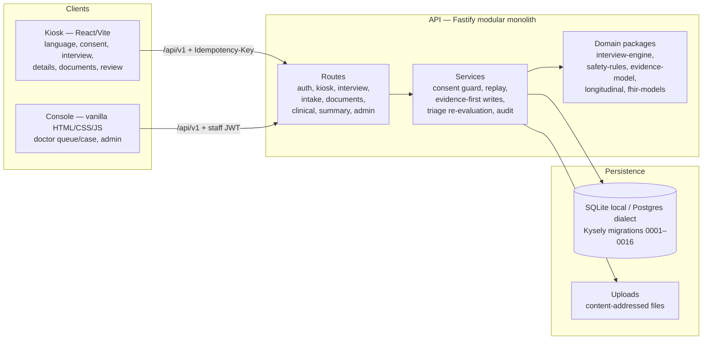
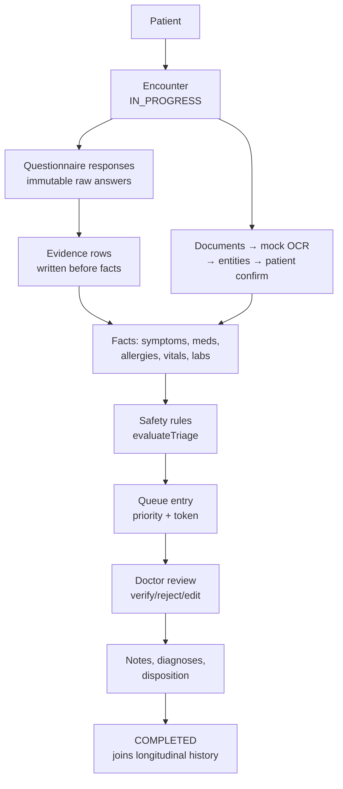

# MediKiosk architecture

## System map

## Data flow: patient to completed encounter

## Layer rules

- Routes validate shapes and authenticate; they never decide authorisation (permissions are
  checked in services via `requireStaff`, consent via `requireConsent`).
- Every clinical mutation runs `authenticate → consent guard → engine → persist
  (evidence-first) → triage → audit` inside one transaction, wrapped in `replayMutation`
  (encrypted idempotent replay, 24 h).
- The interview engine, safety rules, evidence graph, longitudinal diff and FHIR mapper are
  pure packages: no clock (injected `now`), no I/O, no LLM. Determinism is tested, not claimed.
- Provenance classes are structural, not cosmetic: `originClass`
  (PATIENT_REPORTED / DOCUMENT_DERIVED / CLINICIAN_ENTERED / SYSTEM_DERIVED) plus
  `verificationState` (UNVERIFIED / VERIFIED / REJECTED / CORRECTED) on every clinical row;
  evidence rows are immutable (corrections supersede); doctor prose lives in `encounter_notes`,
  apart from everything else.

## Frontend decisions

- Kiosk (React, retained under ADR-013): the working subsystem — do not rewrite without
  re-proving the golden-case and security suites.
- Console (vanilla, ADR-013): no build step; correctness carried by API tests and the E2E
  journeys. The GradientWaves backdrop is the same `ogl` shaders in both (React component in
  the kiosk, `waves.js` in the console), paused when hidden and static under
  `prefers-reduced-motion`.

Further detail: `docs/architecture/*` (phase plans), ADRs in `docs/adr/`, the interview domain
in `docs/interview/DOMAIN.md`.
