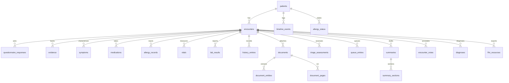

# MediKiosk data model

Migrations `0001–0016` (`services/api/src/db/migrations/`); row types in
`tables.ts` / `tables-clinical.ts` / `tables-evidence.ts` / `tables-system.ts`.

## Core graph

## Conventions (enforced, not suggested)

- Every clinical table carries `tenantId`. Timestamps are ISO-8601 UTC text.
- `originClass` + `verificationState` on every clinical row; evidence immutable
  (`supersededBy` for corrections); audit rows append-only and PHI-free.
- Encounter lifecycle: `IN_PROGRESS → SUBMITTED → COMPLETED`, with `patientConfirmedAt`
  gating submission and `disposition`/`completedAt` at completion.
- Queue lifecycle: `WAITING → CALLED → IN_CONSULTATION → COMPLETED`, plus `CANCELLED`;
  `tokenNumber` (`A-042`) assigned once at submission.
- Document lifecycle: `UPLOADED → EXTRACTED → PATIENT_CONFIRMED → VERIFIED`, plus `REJECTED`.
