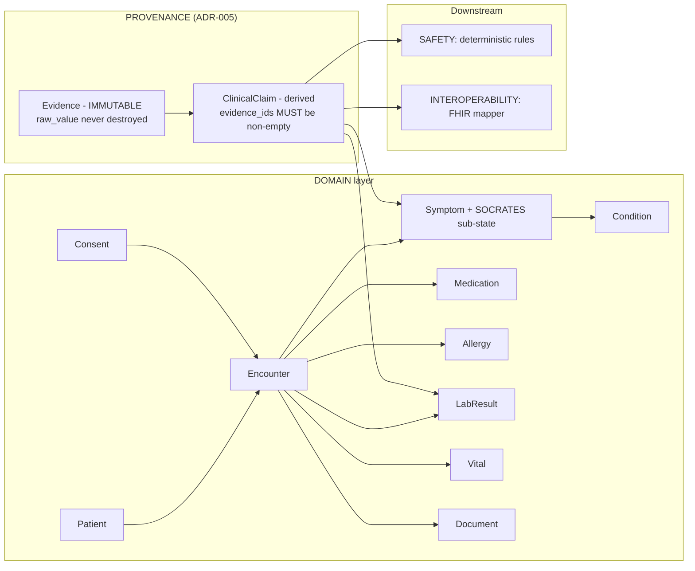

# Clinical Data Model

**Snapshot:** 2026-09-15 · **Status vocabulary and measured repository state:** [`../LIMITATIONS.md`](../LIMITATIONS.md) §2–§3.

Purpose: define the canonical internal clinical model — the model that MediKiosk reasons over, as
opposed to the model it exchanges. It is deliberately **not** a FHIR mirror (ADR-005).

---

## 1. Purpose

Two failure modes must be structurally impossible rather than merely discouraged (ADR-005):

1. **The internal database being a FHIR mirror.** FHIR is verbose, exchange-optimised and full of
   optionality; as an operational schema it makes clinical reasoning queries painful and couples the
   product to an external standard's release cycle.
2. **Untraceable clinical facts.** If a summary says "chest pain for 2 hours", a physician must be able
   to click it and see the exact utterance, timestamp and confidence that produced it.

The model is therefore optimised for clinical reasoning, evidence provenance, validation, longitudinal
analysis, human review and — as a pure function — FHIR mapping.

**What exists today:** the *vocabulary* of this model is real source code, and it is unusually
complete as a specification. The *storage* of it does not exist.

## 2. Position in the layer model

`docs/BASELINE.md` §7 puts the clinical entities in the **DOMAIN** layer and the provenance/evidence
machinery directly beneath the AI output in the same layer, above **SAFETY**. FHIR mapping sits in
**INTEROPERABILITY**, strictly downstream.

`packages/clinical-schema` (status: `PARTIALLY IMPLEMENTED`, typecheck fails) and
`packages/evidence-model` (`PLANNED`) are where this layer lives.

---

## 5. The symptom model: SOCRATES is per-complaint, not global

SOCRATES — Site, Onset, Character, Radiation, Associated symptoms, Timing, Exacerbating/relieving,
Severity — is modelled as a formal sub-state of each complaint (`ADR-005`; implemented as
`packages/clinical-schema/src/socrates.ts`).

The load-bearing design point, stated in that file and in ADR-008: asking a patient with a headache
whether the pain radiates to the left arm is **not thoroughness, it is an error**. Each complaint
declares which dimensions are relevant and whether each is required (`socratesRelevanceSchema`), and
carries its own `rationale` string and `questionKey` so the question can be justified during clinical
review.

| Element | Concrete artefact | Status |
|---|---|---|
| Dimension vocabulary | `SOCRATES_DIMENSIONS`, `SOCRATES_DIMENSION_LABELS` | `PARTIALLY IMPLEMENTED` |
| Per-complaint relevance | `socratesProfileSchema`, `socratesRelevanceSchema` (`questionKey`, `optionKeys`, `rationale`) | `PARTIALLY IMPLEMENTED` |
| Captured state per dimension | `socratesSlotSchema` (`state`, `answer`, `evidenceIds[]`, `askCount`), `emptySocratesState()` | `PARTIALLY IMPLEMENTED` |
| Completion criterion | `socratesCompleteness()` — `requiredRatio` over required dimensions only, plus the `outstanding` list in retry order | `PARTIALLY IMPLEMENTED` |
| Terminal-state semantics | Closing states are `ANSWERED`, `VERIFIED`, `DECLINED`, `UNKNOWN`, `NOT_APPLICABLE`. A patient who declines to describe the character of their pain has answered: the refusal is recorded rather than asked again, and must never be treated as "no character". | `PARTIALLY IMPLEMENTED` |

Each complaint also carries `certainty`, `source`, `confidence`, `verified_at` and `verified_by`
(ADR-005). Complaint-specific SOCRATES variants — cardiac for chest pain, neuro for headache, GI for
abdominal pain — are data, not engine logic; see `interview-engine.md` §5.

## 6. Answer normalisation — additive, never destructive

`packages/clinical-schema/src/answer.ts` defines `normalisedAnswerSchema`. Its doc comment states the
rule: when a patient says "kal se", the physician sees both "kal se" and a resolved date. Destroying
the raw answer would make a misparse undetectable and would remove the patient's own account from the
record.

| Field | Purpose | Why it matters clinically |
|---|---|---|
| `rawAnswer` | The patient's words or selected option | Never overwritten or rewritten |
| `conceptCodes[]` | Canonical codes recognised (e.g. `MK-SYM-001`) | Links the answer to the ontology and therefore to the rule set |
| `duration` + `quantityVerbatim` | Parsed value/unit **and** the verbatim wording ("do din", "about two days") | A patient's approximate quantity survives beside the parsed value |
| `resolvedOnsetDate` | ISO date for relative references ("yesterday", "since Monday") | Relative-date normalisation is auditable |
| `severity` | `SEVERITY_SCALE` ordinal; `SEVERITY_ORDINAL.UNKNOWN = null` | `UNKNOWN` is null so it can never be compared as if it were a low severity |
| `confidence` | Confidence in extraction | Drives the review gate; not a diagnosis |
| `language`, `codeMixed` | BCP-47 language plus a code-mixing flag ("mere chest mein kal se pain hai") | Code-mixed input is the expected case, not an exception |
| `negated`, `uncertain` | Recognition of "bukhar nahi hai", "I think", "pata nahi" | A negation is a real clinical finding, not an absent value |

`quantitySchema` never stores a bare number: a clinical value without a unit is meaningless and
dangerous ("temp 102" could be Fahrenheit or Celsius). It records `referenceSource`
(`SOURCE_DOCUMENT` | `TENANT_CONFIGURED` | `MEDIKIOSK_DEFAULT` | `NOT_AVAILABLE`) because reference
ranges differ by assay and population, and the reporting laboratory's own range is preferred over a
universal table. `LAB_FLAGS` (`NORMAL`, `HIGH`, `LOW`, `CRITICAL_HIGH`, `CRITICAL_LOW`, `UNKNOWN`) is
the deterministic interpretation vocabulary, and `UNKNOWN` is an explicit state rather than an error.

---

## 7. Failure modes and fallbacks

| Failure | Designed behaviour | Status |
|---|---|---|
| A fact has no evidence | The `ClinicalClaim` is rejected at construction (empty `evidence_ids`). No unsupported claim reaches the record. | `PLANNED` |
| Extraction confidence is low | `requiresClinicianReview()` (below `CONFIDENCE_REVIEW_REQUIRED = 0.5`) forces clinician verification; the patient may be asked to confirm; touch fallback is offered | `PARTIALLY IMPLEMENTED` (predicate only) |
| A patient declines or does not know | `DECLINED`/`UNKNOWN` are terminal and distinct from "no". `NOT_A_NEGATIVE_STATES` enumerates the states that must never be coerced to a negative. | `PARTIALLY IMPLEMENTED` |
| A document contradicts the patient | Both facts are retained under different `origin_class` values; the contradiction engine surfaces the conflict rather than resolving it silently | `PLANNED` |
| Code-mixed or unusual free text | Deterministic NER misses it. Accepted and disclosed (`../LIMITATIONS.md` §4.1); `NER_PROVIDER=llm` is the intended remedy once a key exists | Known limitation |
| Duplicate concept codes in the ontology | `buildConceptIndex()` throws — a hard failure, because two concepts sharing a code would make evidence ambiguous | `PARTIALLY IMPLEMENTED` |
| A rule watches a concept the ontology cannot produce | `findOrphanRedFlagConcepts()` surfaces the mismatch at start-up. A rule that can never fire is the most dangerous possible failure in a safety system, so it is surfaced rather than discovered during an incident. | `PARTIALLY IMPLEMENTED` |
| Evidence rows accumulate | Retention follows the clinical record; indexes on `(tenant_id, source_ref)` (ADR-005) | `PLANNED` |

## 8. Status line

| Capability | Status |
|---|---|
| Clinical vocabulary, SOCRATES sub-state, answer normalisation, concept ontology, trigger language | `PARTIALLY IMPLEMENTED` — source present; `packages/clinical-schema` typecheck fails (4 errors) |
| `Evidence` / `ClinicalClaim` storage and construction rules | `PLANNED` — `packages/evidence-model` is a manifest only |
| Persistence of any clinical entity | `PLANNED` — no migration or table has ever been created |
| A clinical record created from a real patient | **No** — synthetic data only; no real patient data has ever been used |
| Longitudinal timeline and "what changed?" comparison | `PLANNED` |
| AYUSH / Dashavidha Pariksha representation | `PLANNED` — `CONCEPT_CATEGORIES` includes `AYUSH` and `FEATURE_AYUSH_ENABLED=true` in `.env.example`; no AYUSH pathway data exists |

<!-- MEDIKIOSK-APPEND -->