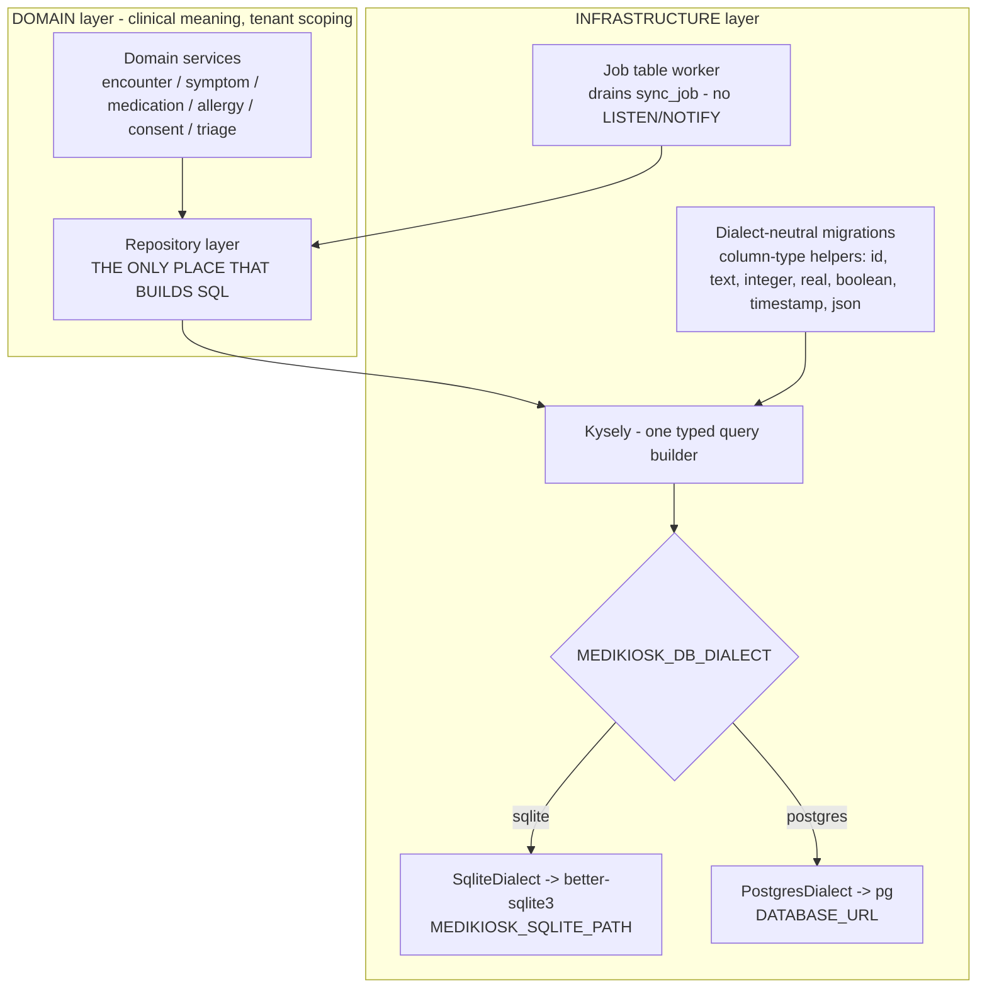

# MediKiosk Data Architecture

**Snapshot:** 2026-09-15 · **Status vocabulary and measured repository state:** [`../LIMITATIONS.md`](../LIMITATIONS.md) §2–§3.

Purpose: state where clinical data lives, how one typed query layer serves two SQL dialects, which
tables the ADRs name explicitly, and what happens when the database is unavailable or the dialects
diverge. **No migration, table, repository or seed exists at the snapshot** — `data/` and
`services/api/` contain no source.

---

## 1. Purpose

Two hard constraints meet in the data layer (`ADR-002`):

1. A fresh clone must be installable, migratable, seedable and demonstrable **on the machine at hand**,
   which has no Docker and no PostgreSQL server.
2. The production deployment must target a real concurrent, backed-up relational database suitable for
   hospital use.

ADR-002 resolves this with **one typed query builder, two dialects**:

| Environment | Dialect | Driver | Verified on this machine |
|---|---|---|---|
| local / dev / demo / test | SQLite | `better-sqlite3` | Yes — prebuilt binary, version 13.0.3, no compiler invoked |
| staging / production | PostgreSQL | `pg` | Driver loads (8.23.0); **no server exists to connect to** |

## 2. Position in the layer model

`docs/BASELINE.md` §7 places the database and everything that touches it in the **INFRASTRUCTURE**
layer, with the DOMAIN layer above it as the only thing permitted to express clinical meaning. The
repository layer is the single seam: no feature code writes SQL (`ADR-002`: "All application queries go
through Kysely. No raw SQL strings in feature code.").

Everything in this diagram is `PLANNED`. Nothing in the INFRASTRUCTURE layer exists on disk.

## 3. Storage rules that the code must obey (ADR-002)

These rules exist because a dual-dialect schema drifts silently otherwise, and drift in a clinical
schema is a data-integrity defect rather than a style issue.

| Rule | Mechanism | Status |
|---|---|---|
| Identifiers are application-generated ULIDs/UUIDs stored as `TEXT` — never engine auto-increment types | Root `package.json` depends on `ulid` in `services/api`; `packages/shared-types/src/ids.ts` defines branded id types (`TenantId`, `PatientId`, `EncounterId`, `DocumentId`, `ConsentId`, `JobId`, `TriageAssessmentId`, `QueueEntryId`, `KioskId`, `SessionId`, `SummaryId`, `UserId`) | `PARTIALLY IMPLEMENTED` — id types exist; `packages/shared-types` does not typecheck |
| Timestamps are ISO-8601 UTC text, so ordering and comparison behave identically in both engines and no timezone conversion happens inside the database | `packages/shared-types/src/clock.ts` (`toIso`, `toIsoDate`, `parseIso`, `daysBetween`); `packages/clinical-schema/src/primitives.ts` `isoDateTimeSchema`, `isoDateSchema` | `PARTIALLY IMPLEMENTED` — helpers exist; packages do not typecheck |
| Booleans are `INTEGER 0/1`, mapped to TypeScript `boolean` at the repository boundary | Repository layer (not yet written) | `PLANNED` |
| JSON columns are a text column plus `JSON.parse` at the boundary, validated by a Zod schema on read | Repository layer + per-entity Zod schemas in `packages/clinical-schema` | `PLANNED` |
| Migrations are dialect-neutral and must contain no SQLite-only or Postgres-only syntax | Column-type helpers (`id`, `text`, `integer`, `real`, `boolean`, `timestamp`, `json`) — ADR-002 names the helper set but **not its file path** (Appendix A) | `PLANNED` |
| Foreign keys are explicitly enabled in SQLite (`PRAGMA foreign_keys = ON`) | Connection factory | `PLANNED` |
| Background work uses a database-backed job table, because Postgres `LISTEN/NOTIFY` has no SQLite equivalent | `sync_job` table (ADR-004) drained by a worker with exponential backoff and a bounded attempt count | `PLANNED` |
| No dependence on Postgres-only features: partial indexes, `JSONB` operators, `LISTEN/NOTIFY` | Design rule; must be enforced by CI against Postgres | `PLANNED` |

---

## 5. Tenant scoping — the query shape that must not exist

ADR-011 makes `tenant_id` a first-class column on every clinical, configuration and audit table, and
enforces scoping in the repository layer rather than trusting callers.

| Rule | Enforcement | Status |
|---|---|---|
| Repository functions **require** a tenant context argument; no API shape permits an unscoped clinical read | Repository signature design — "forgot the tenant filter" must be a compile error, not a leak | `PLANNED` |
| The tenant comes from the authenticated principal, never a client-supplied header | Auth-derived tenant in request context | `PLANNED` |
| A cross-tenant request returns **404, not 403**, because 403 would leak the record's existence | Route-level not-found mapping plus security tests asserting isolation | `PLANNED` |
| `SUPER_ADMIN` is the only legitimately cross-tenant role; it is audited and cannot read clinical content — only configuration and aggregate metrics | Role policy in `packages/auth` | `PLANNED` |
| Indexes are `(tenant_id, …)`-prefixed so scoping does not become the slow path | Migration definitions; ADR-005 names `(tenant_id, source_ref)` on `Evidence` | `PLANNED` |

## 6. Failure modes and fallbacks

| Failure | Designed behaviour | Status |
|---|---|---|
| SQLite is single-writer (`TD-01`) | Writes are short and transactional; a CI dialect job is intended to run the same suite against Postgres so drift is caught in CI rather than in production | `PLANNED` |
| Dialect divergence between SQLite and Postgres | No Postgres-only feature may be depended on; migrations use only the dialect-neutral column helpers | `PLANNED` |
| Database unavailable | The API fails its health check; the kiosk continues from its local durable queue and replays on reconnect (ADR-004) | `PLANNED` |
| Outbound interoperability endpoint down | The transmission was already persisted in `sync_job` inside the clinical write transaction, so no clinical data is lost; the worker retries with exponential backoff and a bounded attempt count | `PLANNED` |
| Duplicate submission after a retry (`R-10`) | Idempotency keys on all mutating clinical endpoints; a replay returns the original result instead of creating a second record | `PLANNED` |
| Concurrent edits to the same field | Last-write-wins with both values retained in edit history; clinical truth is never silently overwritten (ADR-004) | `PLANNED` |
| `Evidence` table growth | Indexes plus a documented retention policy: evidence is retained as long as the clinical record it supports (ADR-005) | `PLANNED` |
| Per-tenant database routing (data residency) | Not implemented. The architecture permits it — all access goes through one repository layer with one dialect selector — but **per-tenant database routing is `PLANNED`** (ADR-011) | `PLANNED` |

## 7. Status line

| Capability | Status |
|---|---|
| Dialect selection via `MEDIKIOSK_DB_DIALECT` | `PLANNED` (documented in `.env.example`; no code reads it) |
| `better-sqlite3` (13.0.3) and `pg` (8.23.0) load on this machine | Verified by probe (`BASELINE.md` §2.1). Driver availability is not an application capability. |
| Kysely query layer, repository layer, migrations, seeds | `PLANNED` |
| Tenant-scoped repository contract | `PLANNED` |
| Postgres CI dialect job | `PLANNED` — `.github/` contains 0 files |
| Per-tenant database routing | `PLANNED` |
| A database has ever been created, migrated or seeded by MediKiosk code | **No** — never executed |

<!-- MEDIKIOSK-APPEND -->