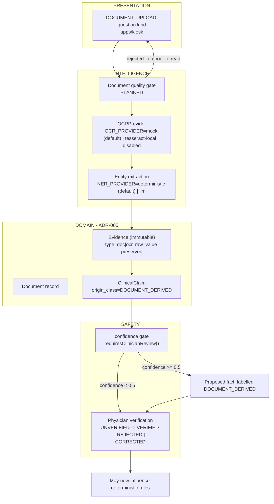

# Document Pipeline

**Snapshot:** 2026-09-15 · **Status vocabulary and measured repository state:** [`../LIMITATIONS.md`](../LIMITATIONS.md) §2–§3.

Purpose: state how an uploaded document becomes verified clinical facts, and precisely which kinds of
document the system can and cannot read. **Handwriting is not supported at all.** No document
component exists at the snapshot.

---

## 1. Purpose

Patients arrive with prior prescriptions, lab reports and discharge summaries. Extracting real values
from them reduces repeated questioning and reduces transcription error — but a misread lab value that
enters the record unverified is worse than no extraction at all (`R-04`, high likelihood, high impact).

The pipeline is therefore designed around three controls: a quality gate before OCR, per-entity
confidence, and mandatory physician verification for low-confidence fields.

## 2. Position in the layer model

`docs/BASELINE.md` §7 places OCR and extraction in the **INTELLIGENCE** layer, the resulting facts in
the **DOMAIN** layer, and the verification step in **SAFETY** (confidence gates and human review).

Everything above is `PLANNED`. Today, the only document-related artefacts in the repository are the
`DOCUMENT_UPLOAD` question kind in `packages/clinical-schema/src/pathway.ts` and the provenance
vocabulary that would label the results.

## 3. What the system can and cannot read

| Document type | Capability | Status |
|---|---|---|
| Printed text, clean scan, installed Tesseract binary | Would be attempted via `OCR_PROVIDER=tesseract-local` | `PLANNED`, `BLOCKED — environment` (no binary installed or vendored) |
| Printed text, no Tesseract, default configuration | Yields the deterministic synthetic provider's output, which is **demo/test data, not a reading of the document** | `MOCKED` |
| **Handwritten prescription or note** | **Not supported by any provider. No handwriting recognition exists.** | `PLANNED` |
| Photographed document, skewed or uneven lighting | Untested; the quality gate is intended to reject rather than guess | `PLANNED` |
| Multi-column lab report | Untested; layout analysis is not implemented | `PLANNED` |
| Regional-language printed document | Untested; OCR language packs are not configured | `PLANNED` |
| Scanned-to-image PDF | Untested; no rasterisation step exists | `PLANNED` |

`../LIMITATIONS.md` §5 is authoritative for these limitations and states the handwriting limitation
prominently, because the original product concept referred to handwritten prescriptions.

---

## 4. Controls that must hold before a document value may influence the record

| Control | Mechanism | Status |
|---|---|---|
| Document text is **DATA, never instructions** | OCR text never reaches a component that can act on it; extraction is schema-constrained; the LLM has no authority to act (`R-05`). The trigger language excludes arbitrary code and configuration-supplied regular expressions so untrusted text cannot change which question is asked. | `PLANNED` |
| Origin is recorded and visible | `DOCUMENT_DERIVED` is one of four `ORIGIN_CLASSES` and is excluded from `TRUSTED_ORIGINS` | `PARTIALLY IMPLEMENTED` (vocabulary only) |
| Raw value is preserved | `Evidence.raw_value` immutable; the extracted text is retained for audit rather than replaced by the parsed value | `PLANNED` |
| Every extracted entity carries confidence | Per-entity confidence field (ADR-005 `Evidence.confidence`) | `PLANNED` |
| Low confidence forces human verification | `requiresClinicianReview()` below `CONFIDENCE_REVIEW_REQUIRED = 0.5` and `describeConfidence()` bands at `CONFIDENCE_RELIABLE = 0.7` | `PARTIALLY IMPLEMENTED` (predicate only) |
| Verification state is explicit | `UNVERIFIED → VERIFIED \| REJECTED \| CORRECTED`, and only a clinician role may perform the transition | `PARTIALLY IMPLEMENTED` (enum only) |
| A value without a unit is never stored | `quantitySchema` requires `unit`; reference range and `referenceSource` are recorded with it | `PARTIALLY IMPLEMENTED` |
| What was sent is auditable | `FHIRResource` rows are persisted with a version (ADR-006) | `PLANNED` |
| Upload validation | File type, size and content checks at the multipart boundary (`@fastify/multipart` is a declared dependency of `services/api`) | `PLANNED` — see `../security/SECURITY.md` §9 |

## 5. Failure modes and fallbacks

| Failure | Designed behaviour | Status |
|---|---|---|
| Unreadable or poor-quality image (`R-04`) | The quality gate is intended to reject the document and ask for a better one rather than extract from noise | `PLANNED` |
| Document type unsupported (handwriting) | Explicitly unsupported and disclosed; the value must be entered by hand or by the physician | Known limitation — `../LIMITATIONS.md` §5.3 |
| OCR silently misreads a digit ("102.1" → "102.7") | Not detectable. Mitigations are per-entity confidence, preserved raw text, and mandatory verification of low-confidence fields. This residual risk is disclosed and must not be described as solved. | Known limitation |
| Extraction produces a fact contradicting the patient | Both facts retained under different `origin_class` values; surfaced by the contradiction engine rather than resolved silently | `PLANNED` |
| OCR provider unavailable or disabled | `OCR_PROVIDER=disabled` turns the capability off entirely; the interview continues without document extraction (document upload remains a question kind, but yields nothing) | `PLANNED` |
| Large document | Size limits and upload validation; the bound is a configuration decision, not yet fixed by any ADR | `PLANNED` |
| Uploaded document retained indefinitely | Pre-processing images are treated as transient and deleted by the wipe and the retention sweep (`MEDIKIOSK_TEMP_RETENTION_MINUTES`). Whether the original uploaded file is transient or part of the record is **not settled by ADR-007** — see `../privacy/PRIVACY.md` §5.3 and `../LIMITATIONS.md` Appendix A. | Open question |

## 6. Status line

| Capability | Status |
|---|---|
| Document upload path, quality gate, OCR provider interface | `PLANNED` |
| Deterministic synthetic OCR (`OCR_PROVIDER=mock`) | `PLANNED`; when built it will be `MOCKED`, never a real OCR |
| Tesseract-local OCR | `PLANNED` / `BLOCKED — environment` (`TD-02`) |
| **Handwriting OCR** | **`PLANNED` — does not exist in any provider** |
| Entity extraction from document text | `PLANNED` (`NER_PROVIDER=deterministic` is a default, not an artefact) |
| Physician verification workflow for extracted fields | `PLANNED` |
| Any real document processed | **No** — never executed; only synthetic inputs would be used, and even those cannot be processed yet |
| Any OCR accuracy or extraction-quality measurement | **Not measured** — no `MEDIKIOSK BENCHMARK RESULT` exists |

<!-- MEDIKIOSK-APPEND -->