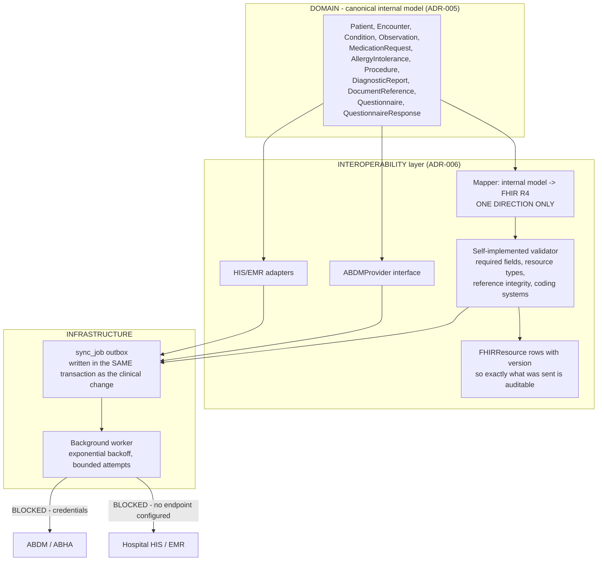

# Interoperability Architecture

**Snapshot:** 2026-09-15 · **Status vocabulary and measured repository state:** [`../LIMITATIONS.md`](../LIMITATIONS.md) §2–§3.

Purpose: state how MediKiosk talks to systems it does not control, in which direction data flows, and
what has provably never happened. **No exchange with any external system has ever been executed.**
Detail: [`../interoperability/FHIR.md`](../interoperability/FHIR.md) and
[`../interoperability/ABDM.md`](../interoperability/ABDM.md).

---

## 1. Purpose

MediKiosk must interoperate with Indian health infrastructure (ABDM/ABHA), hospital information systems
and EMRs. Two facts constrain the design (ADR-006): **no ABDM sandbox credentials exist** (onboarding
requires a registered health facility and approved client credentials, so fabricating an "ABDM
integration" is both impossible and dishonest), and **hospital systems differ wildly** — some speak
FHIR, many speak proprietary HL7 v2 or a REST API, and many speak nothing yet.

## 2. Position in the layer model

`docs/BASELINE.md` §7 places FHIR R4, the ABDM adapter, the HIS/EMR outbox and sync in the
**INTEROPERABILITY** layer, downstream of the DOMAIN layer, with **INFRASTRUCTURE** providing the job
table that makes delivery durable.

Every node is `PLANNED`.

## 3. Direction of mapping is not negotiable

The mapper converts the internal clinical model **into** FHIR R4. FHIR is **never** the operational
schema, and the reverse mapping is not the operational path (ADR-005, ADR-006). Two consequences:

1. FHIR mapping is a **pure function** of the internal model, and is therefore unit-testable without a
   server.
2. A change to the internal model cannot silently change the meaning of stored clinical data, because
   stored data is internal, not FHIR.

## 4. Provider model

| External system | Interface | Implementations | Status |
|---|---|---|---|
| ABDM / ABHA | `ABDMProvider` | `MockABDMProvider` (deterministic, offline, used by tests and demo), `SandboxABDMProvider` (real signed HTTP requests, requires approved credentials), `ProductionABDMProvider` (same interface, production endpoints, HIU/HIP roles) | Mock and sandbox are *specified* as code artefacts; **`PLANNED` at the snapshot**; production `PLANNED`; execution `BLOCKED — credentials` |
| Hospital HIS / EMR | Generic adapters over the FHIR mapper plus the outbox | Export, import, sync, retry, idempotency, authentication, failure handling, status tracking | `PLANNED` |
| Legacy HL7 v2 systems | Not implemented | ADR-006 records a v2 adapter as "a legitimate future addition for legacy HIS" | `PLANNED`, out of scope |

## 5. The outbox is what makes delivery lossless

FHIR/ABDM/HIS transmissions are written to a `sync_job` row **inside the same transaction as the
clinical change** (ADR-004 tier 2). Delivery is therefore not lost if the outbound call fails, and a
single-hospital pilot with an unreliable uplink does not lose referrals. The worker drains the outbox
with exponential backoff and a bounded attempt count, and every job records type, status, attempts,
next attempt time and last error.

<!-- MEDIKIOSK-APPEND -->