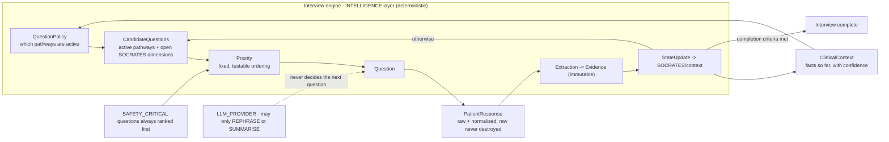

# Interview Engine

**Snapshot:** 2026-09-15 · **Status vocabulary and measured repository state:** [`../LIMITATIONS.md`](../LIMITATIONS.md) §2–§3.

Purpose: state how the adaptive interview works, why it is a deterministic engine over data-driven
pathways rather than a large prompt, and exactly which guarantees hold. **The engine does not exist at
the snapshot**; its data model does, as source.

---

## 1. Purpose

The central product capability is an adaptive clinical interview that behaves like a competent
clinician taking a history: it characterises the chief complaint, follows that complaint's own logic,
asks safety-critical questions early, and stops when it has enough.

## 2. Position in the layer model

`docs/BASELINE.md` §7 places the interview engine in the **INTELLIGENCE** layer (question selection),
consuming the **DOMAIN** layer's `ClinicalContext` and `Evidence`, and feeding **SAFETY**.

The loop, verbatim from ADR-008: `InterviewSession → ClinicalContext → QuestionPolicy →
CandidateQuestions → Priority → Question → PatientResponse → Extraction → Evidence → StateUpdate →
NextQuestion (or completion)`.

Everything above is `PLANNED` except the pathway/question/SOCRATES/trigger **data model**, which exists
as source in `packages/clinical-schema` (`PARTIALLY IMPLEMENTED`, typecheck fails).

## 3. Why not one large prompt (ADR-008)

The tempting implementation is one prompt containing the whole history, asking an LLM "what should I ask
next?". ADR-008 rejects it, and the reasons are the design requirements:

| Rejection reason | Consequence for the design |
|---|---|
| The interview cannot be audited (why was this question asked?) | Every pathway question carries a mandatory `rationale` (`pathwayQuestionSchema.rationale`) |
| The interview cannot be measured (is this question necessary?) | Deterministic ordering makes question count and unnecessary-question rate measurable |
| It cannot be versioned or clinically reviewed | Pathways carry a `version`, and `evaluation/interview` is intended to compare versions |
| Coverage cannot be guaranteed (the model may never ask about allergies) | Coverage is guaranteed by construction and asserted by tests |
| The same input may produce different interviews | Determinism is required for measurement and audit |
| Clinical safety questions could be silently skipped | `SAFETY_CRITICAL` is rank 1 in `CATEGORY_PRIORITY_RANK` |

---

## 4. Response states are explicit and distinct

Collapsing these states is a clinical error, so they are enumerated separately in
`packages/shared-types/src/response-state.ts`:

`UNANSWERED`, `ANSWERED`, `SKIPPED`, `DECLINED`, `UNKNOWN`, `CONTRADICTORY`, `LOW_CONFIDENCE`,
`NEEDS_CLARIFICATION`, `VERIFIED`, `NOT_APPLICABLE`.

| Property | Values | Why |
|---|---|---|
| Carries a usable clinical answer | `ANSWERED`, `VERIFIED` (`ANSWERED_STATES`, `isAnswered()`) | Anything else may not be used as a fact |
| Must never be coerced to "no" | `NOT_A_NEGATIVE_STATES` = `UNANSWERED`, `SKIPPED`, `DECLINED`, `UNKNOWN`, `LOW_CONFIDENCE`, `CONTRADICTORY`, `NEEDS_CLARIFICATION` | **"No known allergies" and "patient did not answer" are different clinical facts.** Treating them as equivalent is a documented cause of medication error. |
| Still open, so the interview may retry (possibly via another modality) | `isOpen()` = `UNANSWERED`, `LOW_CONFIDENCE`, `NEEDS_CLARIFICATION`, `CONTRADICTORY` | A retry is legitimate while we still do not know |
| Terminal, so the interview must stop asking | `isTerminal()` = `ANSWERED`, `VERIFIED`, `DECLINED`, `UNKNOWN`, `NOT_APPLICABLE` | A patient has the right to refuse, and the system records the refusal rather than nagging |

`response-state.ts` exists and is the authoritative vocabulary; its consumers (allergy engine, safety
engine) do not re-derive the rule. Status: `PARTIALLY IMPLEMENTED` (source present;
`packages/shared-types` typecheck fails with 3 errors).

## 5. Question priority order (fixed and testable)

From ADR-008, with the code constants that implement it:

| Rank | Category (`QUESTION_CATEGORIES`) | Rank constant (`CATEGORY_PRIORITY_RANK`) | Purpose |
|---|---|---|---|
| 1 | `SAFETY_CRITICAL` | 1 | Capture what matters most even if the interview is interrupted |
| 2 | `CHIEF_COMPLAINT` | 2 | Characterise the complaint via its relevant SOCRATES dimensions |
| 3 | `RELEVANT_HISTORY` | 3 | Comorbidities, medications, allergies |
| 4 | `MEDICATION_ALLERGY` | 4 | Medication and allergy risk |
| 5 | `CONTEXTUAL` | 5 | Family, personal, social, AYUSH history |
| 6 | `COMPLETENESS` | 6 | Fill remaining gaps |

SOCRATES relevance is **per complaint**, not global. ADR-008 gives the three canonical examples:
chest pain triggers a cardiac-oriented variant (radiation to arm/jaw, exertional exacerbation,
associated dyspnoea/diaphoresis); headache triggers a neuro-oriented variant (sudden onset / "worst
ever", photophobia, neck stiffness, focal neuro deficit); abdominal pain triggers a GI variant (site
migration, relation to food, bowel/vaginal bleeding).

## 6. Pathways are data, not code

Each pathway declares an entry condition, required and optional questions, branching conditions,
escalation conditions and completion criteria, and is versioned. In code,
`packages/clinical-schema/src/pathway-model.ts` defines `InterviewPathway` with `key`, `version`,
`displayName`, `complaintCodes`, `entryWhen`, `askWhen?`, `questions`, `branches`, `completion`,
`escalation` and `priorityRank`, plus `completionCriteriaSchema` (`socratesRequiredRatio` default 1,
`maxQuestions` default 40).

The trigger language (`packages/clinical-schema/src/trigger.ts`) is a serialisable expression tree with
**one** deterministic, total evaluator (`trigger-eval.ts`): for any expression and any context it
returns a boolean and cannot throw. It deliberately excludes arbitrary code, configuration-supplied
regular expressions, and anything that could evaluate user-supplied text as logic.

| Property | Mechanism | Status |
|---|---|---|
| Branch conditions are declarative and inspectable | `PathwayBranch` = `key`, `when`, `questionKeys`, `description` | `PARTIALLY IMPLEMENTED` |
| A clinician can read what a condition tests | `describeTrigger()` in `trigger-describe.ts`, used by the admin rule viewer, the physician console and the evaluation report so a rule is never described differently in two places | `PARTIALLY IMPLEMENTED` |
| Adding a question cannot silently break a pathway | `validatePathway()` runs at load time and reports duplicate question keys, branch references to undefined questions, empty branches, required-question count exceeding `maxQuestions`, empty question lists and missing complaint codes | `PARTIALLY IMPLEMENTED` |
| Age applicability never silently removes coverage | `questionAppliesToAge()` includes the question when age is unknown, because silently skipping questions would reduce coverage without anyone noticing | `PARTIALLY IMPLEMENTED` |
| A pathway escalation **does not set triage** | `PathwayEscalation` "does NOT set the triage level. Setting triage is the exclusive responsibility of the deterministic red-flag rule engine (ADR-009)"; an advisory only requests clinician attention | `PARTIALLY IMPLEMENTED` (comment and type) |
| Missing fact default differs between pathway entry and safety | A missing fact makes a pathway-entry predicate false rather than raising; the safety engine instead treats missing safety-critical data as requiring human review (`trigger-eval.ts` doc comment; ADR-009 rule 2) | `PARTIALLY IMPLEMENTED` |

---

## 7. The LLM's permitted role, stated as a prohibition list

The LLM **may**: rephrase a question more naturally in the patient's language, and summarise
already-established facts.

The LLM **may not**: decide which question comes next, skip a safety question, or introduce a new
clinical fact. This is what keeps the interview reproducible and auditable while still feeling natural.

That prohibition is enforced structurally rather than by instruction: the question-priority logic lives
in deterministic code (`CATEGORY_PRIORITY_RANK`, `activeQuestionKeys()`, `socratesCompleteness()`), and
the LLM provider is not reachable from it.

## 8. Failure modes and fallbacks

| Failure | Designed behaviour | Status |
|---|---|---|
| A required question is never reached | Completion is defined by `CompletionCriteria.socratesRequiredRatio` (default 1.0) plus `required` flags on questions; the interview is not complete until required items reach a terminal state | `PARTIALLY IMPLEMENTED` |
| A pathway references a question that does not exist | `validatePathway()` fails at load time, not mid-interview — a confusing patient-facing failure mid-interview is the worse outcome | `PARTIALLY IMPLEMENTED` |
| A question is asked forever | `maxAsks` and `socratesSlotSchema.askCount` bound repetition | `PARTIALLY IMPLEMENTED` |
| Patient declines everything | `DECLINED` is terminal, so the interview completes with recorded refusals. The safety engine then treats the missing safety-critical data as requiring human review (ADR-009 rule 2) rather than as negative. | `PLANNED` (engine side) |
| Patient gives a contradictory answer | `CONTRADICTORY` is both a response state and an `isOpen()` state, so the engine may retry; the contradiction engine may also surface it as a structured conflict | `PARTIALLY IMPLEMENTED` |
| Interview interrupted (session timeout or kiosk wipe) | Safety-critical questions are ranked first, so an interrupted interview has still captured what matters most. The in-progress encounter is persisted server-side once consent is granted, so a wipe clears kiosk state without discarding answers (ADR-007). | `PLANNED` |
| A new complaint is added | Adding a complaint is adding data plus tests, not changing engine logic | `PLANNED` |
| Pathway content is clinically wrong or incomplete | The shipped set is a curated starter set flagged `TD-06`; clinical advisory review is the repayment trigger | Known limitation — see `../clinical-safety/CLINICAL_SAFETY.md` §9 |

## 9. Status line

| Capability | Status |
|---|---|
| Pathway, question, SOCRATES, trigger data model and validation | `PARTIALLY IMPLEMENTED` — source present; `packages/clinical-schema` typecheck fails (4 errors) |
| Deterministic interview engine (selection, priority, state updates, completion) | `PLANNED` |
| Shipped pathways: chest pain, fever, cough/respiratory, headache, abdominal pain, diabetes, hypertension, trauma, pregnancy, pediatric, elderly/general, AYUSH Dashavidha Pariksha | `PLANNED` — ADR-008 specifies the set; no pathway data file exists |
| Pathway storage as `Questionnaire`/`Question` rows, admin-editable and versioned | `PLANNED` |
| LLM-assisted phrasing | `PLANNED` — `LLM_PROVIDER=mock` by default, `openai`/`ollama` `BLOCKED — credentials` |
| Interview measurement (question count, duration, completeness, unnecessary-question rate, safety-question coverage) | `PLANNED` — `evaluation/interview` is named in ADR-008; `evaluation/` contains 0 files, so **no interview metric has ever been measured** |
| Any pathway clinically reviewed | **No** — `TD-06` |

<!-- MEDIKIOSK-APPEND -->