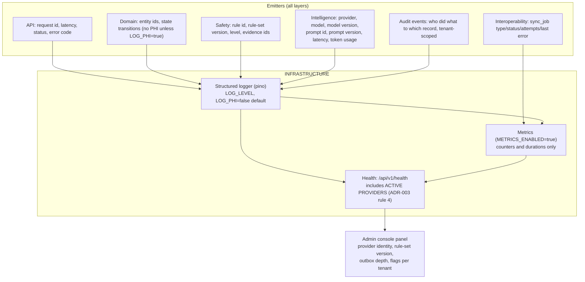

# Observability Architecture

**Snapshot:** 2026-09-15 · **Status vocabulary and measured repository state:** [`../LIMITATIONS.md`](../LIMITATIONS.md) §2–§3.

Purpose: state what an operator can see about a running MediKiosk, what is deliberately not recorded,
and which signals a hospital should alert on. **No observability artefact exists at the snapshot.**

---

## 1. Purpose

MediKiosk runs unattended in a waiting room and is safety-adjacent. Its observability requirements are
therefore unusual in one specific way: **the system must make it obvious when its AI capabilities are
running as mocks**, because a clinician or a judge must never mistake a deterministic stand-in for a
real model (ADR-003 rule 4).

Three jobs, in priority order:

1. Tell the truth about what is running (provider identity, rule-set version, rule-set coverage).
2. Tell an operator when the system is failing (health, jobs, outbox depth, error rates).
3. Support measurement without leaking PHI (counts and durations, not free text).

## 2. Position in the layer model

`docs/BASELINE.md` §7 places logging, metrics and health in the **INFRASTRUCTURE** layer; every other
layer emits into it. Provider identity is surfaced through the **API** layer's health endpoint and the
**PRESENTATION** layer's admin console.

Every node is `PLANNED`. `LOG_LEVEL`, `LOG_PHI` and `METRICS_ENABLED` are the only observability
configuration that exists today, and they exist only as lines in `.env.example`.

## 3. What must be observable, and why

| Signal | Why it must exist | Status |
|---|---|---|
| **Active provider identity** for ASR, TTS, OCR, NER and LLM | ADR-003 rule 4: "A mock provider is never presented as real." Exposed in `/api/v1/health` and the admin console. | `PLANNED` |
| Active `RedFlagRuleSet` version | ADR-009 rule 4: every `TriageAssessment` records the version, so a historical decision can be replayed against the rule set that produced it | `PLANNED` |
| Rule-set coverage report | ADR-009: a rule set that silently watches nothing is the failure this detects; supported by `triggerReferences()` and `findOrphanRedFlagConcepts()` | `PARTIALLY IMPLEMENTED` (helpers) |
| Every LLM call | ADR-003 rule 3: provider, model, model version, prompt id, prompt version, latency, token usage | `PLANNED` |
| `sync_job` status, attempts, next attempt, last error | ADR-004: delivery is durable, so job state is the only way to see an undelivered transmission | `PLANNED` |
| Health of the database dialect in use | `MEDIKIOSK_DB_DIALECT` selection is a runtime fact an operator must be able to confirm | `PLANNED` |
| Feature flags per tenant | ADR-011: a disabled capability must be visibly disabled, since flags are enforced server-side | `PLANNED` |
| Audit events | Who verified, corrected, rejected or overrode what, and when | `PLANNED` |

## 4. What is deliberately not recorded

| Not recorded | Rule |
|---|---|
| Clinical free text | Redacted when `LOG_PHI=false` (the default). `LOG_PHI=true` is an explicit operator decision with a documented consequence. |
| Passwords, tokens, session keys | Never logged, in any configuration. |
| Full ABHA identifiers | Never logged; identity data is separable from clinical data (`../privacy/PRIVACY.md` §2). |
| Raw uploaded documents | Never logged. |
| Raw model prompts containing PHI | The call record is metadata (provider, model, prompt **id**, prompt **version**, latency, tokens), not prompt content. |

---

## 5. What observability is *for*, given no benchmark has been run

`METRICS_ENABLED=true` exists in `.env.example`, and ADR-011 requires usage metrics to be emitted so a
commercial model can be layered on later. Beyond billing, the metrics that matter clinically are:

| Metric | Purpose | Status |
|---|---|---|
| Encounters per tenant per period | Capacity and adoption; billing readiness (ADR-011) | `PLANNED` |
| Active kiosks | Fleet health; identifies a dead kiosk before a patient queue forms | `PLANNED` |
| Documents processed | Volume; the denominator for any future OCR quality claim | `PLANNED` |
| Provider calls (per capability, per provider) | Detects silent fallback to the deterministic provider | `PLANNED` |
| Triage levels issued per period | Detects over-triggering and drift after a rule-set change | `PLANNED` |
| `DATA_INCOMPLETE` advisories | The fail-safe firing rate — a safety signal, not an error rate | `PLANNED` |
| `sync_job` depth and age of oldest job | Undelivered interop is a clinical-safety-relevant backlog | `PLANNED` |
| Provider latency for each AI capability | The offline/latency research question (`research/RESEARCH.md` §2.7) | `PLANNED` |
| Verification rate (`UNVERIFIED` remaining) | Detects a console that nobody uses | `PLANNED` |

**None of these is collected today**, because there is no runtime. **No figure in this document set is
derived from any of them**, and no number labelled `MEDIKIOSK BENCHMARK RESULT` appears anywhere until
the evaluation harness has actually run.

## 6. Failure modes and fallbacks

| Failure | Designed behaviour | Status |
|---|---|---|
| Log volume exhausts disk | Operator concern: log destination and rotation are not specified by any ADR and are documented as a deployment task (`../deployment/PRODUCTION.md` §6) | Open |
| PHI enters logs accidentally | The mitigation is an allow-list redactor rather than a deny-list, because a deny-list fails on the field nobody thought of. `LOG_PHI=false` is the default. Residual risk: an unrecognised PHI field can still be logged. | `PLANNED` |
| Health endpoint used to fingerprint the deployment | Health must report provider identity without secrets, tokens or full identifiers | `PLANNED` |
| A mock provider is mistaken for a real one | ADR-003 rule 4 requires active provider identity in both `/api/v1/health` and the admin console, and `model_provider` on every artefact. This is the specific failure this design exists to prevent. | `PLANNED` |
| Metrics used to identify an individual | Metrics are counters and durations, tenant- and kiosk-scoped, never patient-scoped | Design constraint |
| Observability endpoint reachable from the internet | Monitoring endpoints are intended to be bound to the internal network / behind the reverse proxy, not publicly exposed (`../deployment/PRODUCTION.md` §6) | `PLANNED` |
| Audit log tampering | Not mitigated: no append-only storage, no hash chaining, no external log sink. **Disclosed as an accepted gap.** | Accepted gap |

## 7. Status line

| Capability | Status |
|---|---|
| Structured PHI-safe logger | `PLANNED` — `pino` and `pino-pretty` are declared dependencies of `services/api`; no code uses them |
| Metrics endpoint | `PLANNED` |
| Health endpoint (`/api/v1/health`) | `PLANNED` — named by ADR-003 rule 4; no route exists |
| Admin console observability panel | `PLANNED` |
| Evaluation-harness reporting | `PLANNED` — `evaluation/` contains 0 files |
| Any metric has ever been emitted by this system | **No** |
| Any monitoring alert has ever fired | **No** — no alerting rules exist |

<!-- MEDIKIOSK-APPEND -->