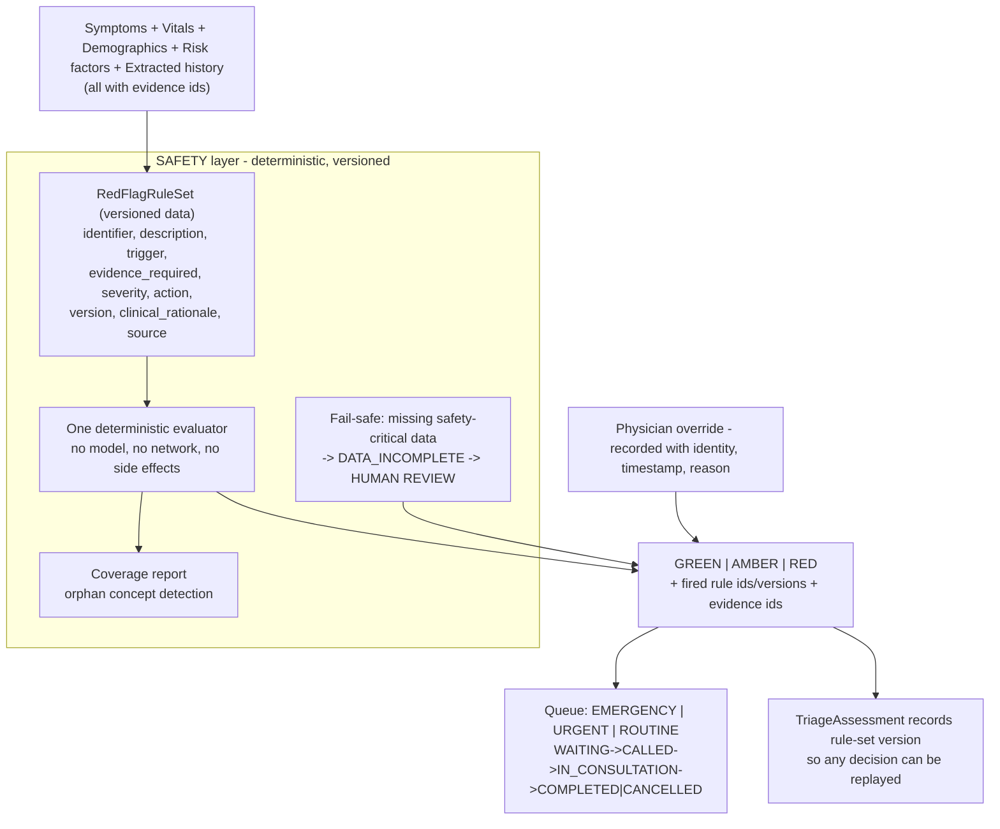

# Safety Architecture

**Snapshot:** 2026-09-15 · **Status vocabulary and measured repository state:** [`../LIMITATIONS.md`](../LIMITATIONS.md) §2–§3.

Purpose: state how triage is decided, why a model can never decide it, and what the system does when it
does not know. **The engine does not exist at the snapshot**; `packages/safety-rules` is a manifest
only. The full clinical treatment is in [`../clinical-safety/CLINICAL_SAFETY.md`](../clinical-safety/CLINICAL_SAFETY.md).

---

## 1. Purpose

MediKiosk must route a patient with chest pain and dyspnoea to priority human triage. This is the
highest-consequence decision in the system: if it is wrong in the direction of *under*-triage, a
patient may come to harm (`R-02`, medium likelihood, critical impact).

An LLM cannot be the authority, for four independent reasons (ADR-009): **non-determinism** (the same
patient could receive a different level on a retry), **non-auditability** ("the model thought so" is
not defensible to a clinician), **no bounded error** (there is no way to prove the set of emergencies
it can miss), and **prompt injection** (uploaded document text is attacker-influenced input).

A bare red banner is also rejected as product design: "Emergency detected" with no reasoning gives a
clinician nothing to act on and creates alarm fatigue.

## 2. Position in the layer model

`docs/BASELINE.md` §7 places SAFETY between the DOMAIN/INTELLIGENCE layers and INTEROPERABILITY. Its
inputs are established facts with evidence; its output is a level, a named rule and evidence
references. It consumes **no model output**.

Every node is `PLANNED`.

## 3. The separation that must not be crossed

| Prohibition | Mechanism | Status |
|---|---|---|
| A model may not evaluate a rule | The rule evaluator is total and deterministic (`trigger-eval.ts` is the same evaluator used for pathway conditions: for any expression and any context it returns a boolean and cannot throw) | `PARTIALLY IMPLEMENTED` (evaluator only; rule engine `PLANNED`) |
| A pathway may not set a triage level | `PathwayEscalation` is explicitly an advisory that "does NOT set the triage level" | `PARTIALLY IMPLEMENTED` (type and comment) |
| Prompt injection cannot influence triage | Rule evaluation never consults model output; document text is data | `PLANNED` |
| A rule may not fire without evidence | `evidence_required` is mandatory on every rule, and the engine returns the fired rule **with its evidence ids** so the UI can show them | `PLANNED` |
| A rule may not silently watch nothing | `findOrphanRedFlagConcepts()` and `triggerReferences()` exist to answer "does any rule watch for this input?" — a rule set that watches nothing is the failure mode they detect | `PARTIALLY IMPLEMENTED` (helpers exist) |

---

## 4. Rule schema and shipped rule identifiers

Every rule declares: `identifier`, `description`, `trigger` (declarative, evaluated deterministically),
`evidence_required`, `severity`, `action`, `version`, `clinical_rationale`, `source` (ADR-009).

Rule identifiers are stable and human-readable. ADR-009 names these as examples of the starter set:

| Rule id | Trigger (as specified) | Severity |
|---|---|---|
| `CHEST_PAIN_HIGH_RISK_001` | chest pain **and** dyspnoea | RED — immediate human triage |
| `CHEST_PAIN_HIGH_RISK_002` | chest pain with radiation to arm/jaw, or diaphoresis | RED |
| `STROKE_SCREEN_001` | sudden severe headache with focal neuro deficit or neck stiffness | RED |
| `SEPSIS_SCREEN_001` | fever with tachycardia **and** tachypnoea | AMBER/RED |
| `HYPOXIA_001` | SpO2 below threshold | RED |
| `HYPOTENSION_001` | systolic BP below threshold | AMBER |
| `HYPERGLYCAEMIA_CRITICAL_001` / `HYPOGLYCAEMIA_CRITICAL_001` | from lab or glucometer | RED |
| `PEDIATRIC_FEVER_001`, `PREGNANCY_BLEEDING_001`, `TRAUMA_MECHANISM_001` | condition-specific | RED/AMBER |
| `SELF_HARM_RISK_001` | explicit risk statement | immediate human escalation |

**This is a curated starter set, not a validated clinical decision instrument** (`TD-06`). Thresholds
are named as "below threshold" in the ADR, and the numeric threshold is a tenant-tunable configuration
value (ADR-011), not a clinically derived constant.

## 5. Fail-safe behaviour: "not asked" is never "not present"

ADR-009 rule 2: unknown or unanswered safety-critical fields produce a `DATA_INCOMPLETE` advisory that
**requires human review**. The engine never treats "not asked" as "not present". This is the mechanism
that makes under-triage from silence impossible by default.

The contrast with pathway evaluation is deliberate and is documented in code
(`packages/clinical-schema/src/trigger-eval.ts`): a missing fact makes a *pathway entry* predicate
false, because the interview must not invent a pathway for a patient we know nothing about. The two
behaviours differ because the two decisions have different failure costs.

`NOT_A_NEGATIVE_STATES` (`packages/shared-types/src/response-state.ts`) lists the response states that
must never be coerced to a negative: `UNANSWERED`, `SKIPPED`, `DECLINED`, `UNKNOWN`, `LOW_CONFIDENCE`,
`CONTRADICTORY`, `NEEDS_CLARIFICATION`.

## 6. Failure modes and fallbacks

| Failure | Designed behaviour | Status |
|---|---|---|
| A safety-critical question was never asked | `DATA_INCOMPLETE` advisory requiring human review; never treated as negative | `PLANNED` |
| The rule set contains no rule for a risky presentation | Not detectable automatically. Mitigations: the coverage report (`triggerReferences`, `findOrphanRedFlagConcepts`) and clinical review of the set. Residual risk disclosed as the difference between a safety *net* and a safety *guarantee*. | Known limitation |
| Rule set is updated | Every `TriageAssessment` records the active `RedFlagRuleSet` version, so a historical decision can be replayed against the rule set that produced it | `PLANNED` |
| A rule fires without evidence | Treated as a bug: `evidence_required` is mandatory and the engine returns the fired rule with its evidence ids | `PLANNED` |
| The engine is unavailable | No triage is produced. The intended behaviour is that the encounter is routed to staff review rather than defaulting to `GREEN`; a default of `GREEN` would be an automatic under-triage path and is explicitly not the design. | `PLANNED` |
| A clinician disagrees with the level | The physician may override the triage level, and the override is recorded with identity, timestamp and reason. The engine can escalate but never de-escalate a clinician, and the system never overrides the clinician. | `PLANNED` |
| Patient disappears from the queue | Queue statuses are explicit with every transition timestamped, so a patient cannot silently vanish | `PLANNED` |
| Triage queue floods (over-triage) | Deliberate design bias: a false positive costs a clinician a minute, a false negative can cost a life. Thresholds are tenant-tunable for escalation capacity. | Design constraint |
| Emergency service unavailable | Out of scope: MediKiosk routes to a human, it does not summon an ambulance. | Scope boundary |

## 7. Status line

| Capability | Status |
|---|---|
| Deterministic trigger expression language and its total evaluator | `PARTIALLY IMPLEMENTED` — `packages/clinical-schema/src/trigger.ts`, `trigger-eval.ts`, `trigger-describe.ts` (package typecheck fails) |
| Triage level and queue vocabulary | `PARTIALLY IMPLEMENTED` — `packages/shared-types/src/triage.ts` |
| `RedFlagRuleSet`, rule engine, `evidence_required` enforcement, fail-safe advisory | `PLANNED` — `packages/safety-rules` is a manifest only |
| Queue and triage console | `PLANNED` |
| Physician override with recorded identity, timestamp, reason | `PLANNED` |
| Rule-set coverage report | `PLANNED` (helper functions exist) |
| Sensitivity, specificity, false-negative and false-positive rates | **Not measured.** No benchmark has been run. `../clinical-safety/CLINICAL_SAFETY.md` §8 states the measurement plan; no number may be quoted until the harness exists. |
| Clinical validation of the rule set | **`NOT ESTABLISHED`** — no clinical advisory review has occurred (`TD-06`) |

<!-- MEDIKIOSK-APPEND -->