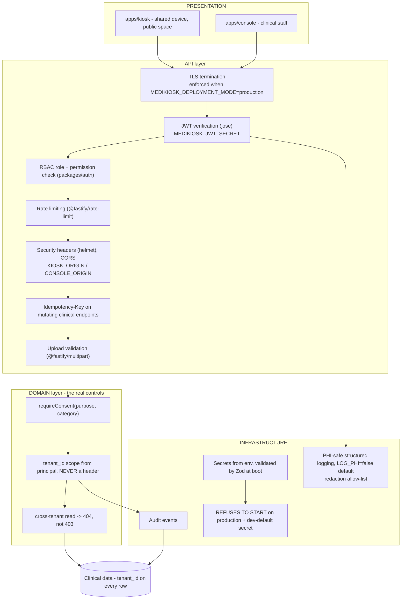

# Security Architecture

**Snapshot:** 2026-09-15 · **Status vocabulary and measured repository state:** [`../LIMITATIONS.md`](../LIMITATIONS.md) §2–§3.

Purpose: state the trust boundaries, the authentication and authorisation model, the tenancy isolation
mechanism, and the disclosure of what security work has not been done. **No security control exists in
code at the snapshot** — `packages/auth` is a manifest only, and `services/api` has no source. The full
threat model, role matrix and audit catalogue are in [`../security/SECURITY.md`](../security/SECURITY.md).

---

## 1. Purpose

MediKiosk processes PHI on a shared kiosk in a public waiting area and transmits it to hospital
systems. Three failure classes dominate (`BASELINE.md` §6): PHI leaking into logs (`R-06`, medium
likelihood, critical impact), cross-tenant data access (`R-07`, low likelihood, critical impact), and
prompt injection via an uploaded document (`R-05`, medium, high).

## 2. Position in the layer model

`docs/BASELINE.md` §7 places secrets, logging, metrics and health in the **INFRASTRUCTURE** layer, the
JWT and RBAC checks in the **API** layer, and the mechanical consent and tenancy guards in the
**DOMAIN** layer — the last point is the important one: security checks that live only in the UI are
not controls.

Every node is `PLANNED`.

## 3. Assets, in the framing the threat model uses

| Asset | Integrity requirement | Availability requirement | Confidentiality requirement |
|---|---|---|---|
| Clinical record (encounter, symptoms, labs, vitals, medications, allergies) | **Highest** — a corrupted clinical fact is a patient-safety event, not a data-quality issue | High — a clinician must be able to read the record when the patient is in front of them | High — PHI |
| Evidence store (`Evidence.raw_value`) | **Highest and append-only** — destroying the raw value destroys the audit chain | High | High |
| Consent records | Highest — legal and ethical basis for processing | High | High |
| Triage assessments and queue state | **Highest** — misordering an emergency is a safety event | **Highest** — the queue is the safety net's output | High |
| Audit events | High — tampering with the audit trail is itself an incident | High | High — but they must not contain PHI beyond `LOG_PHI` |
| Identity data (ABHA identifier, OTP artefacts) | High | Medium | **Highest** — and separable from clinical data (`../privacy/PRIVACY.md` §2) |
| Documents (uploads, pre-processing images) | High | Medium | High — transient for images |
| Telemetry, analytics and metrics | Medium | Low | Medium — must be aggregated or pseudonymised |

## 4. The mechanisms that carry the weight

| Mechanism | Concrete artefact | Status |
|---|---|---|
| Tenant isolation | `tenant_id` column on every clinical, configuration and audit table; repository functions **require** a tenant context argument so an unscoped read is a compile error (ADR-011) | `PLANNED` |
| Cross-tenant reads are indistinguishable from absent records | 404, never 403 (ADR-011), asserted by security tests | `PLANNED` |
| Consent enforcement is mechanical | `requireConsent(purpose, category)` in the **domain service layer**, not the route handler and not the UI; revocation re-checks the same guard on every read and write (ADR-007) | `PLANNED` |
| Passwords and tokens are hashed/verifiable | `bcryptjs` and `jose` are declared dependencies of `packages/auth` | `PLANNED` |
| Secrets are never committed | `.env.example` committed, `.env` never; `.gitignore` present | `IMPLEMENTED` (convention only) |
| Insecure defaults cannot reach production | Zod environment validation at boot; `NODE_ENV=production` with a development default secret, or `IDENTITY_PROVIDER=abha` without credentials, **refuses to start** (ADR-010) | `PLANNED` |
| PHI does not enter logs by default | `LOG_PHI=false`; the PHI-safe logger's redaction allow-list (`R-06`) | `PLANNED` |
| Document text cannot steer the system | Treated strictly as untrusted DATA, never instructions; extraction schema-constrained; the trigger language cannot evaluate user text as logic (ADR-009, `R-05`) | `PARTIALLY IMPLEMENTED` (trigger language only) |
| Retries cannot duplicate clinical records | Idempotency keys validated by a shared Zod request schema rather than by convention (ADR-004, `R-10`) | `PLANNED` |

<!-- MEDIKIOSK-APPEND -->