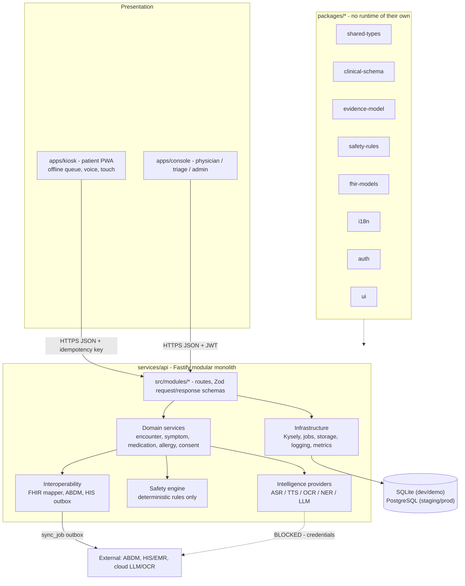
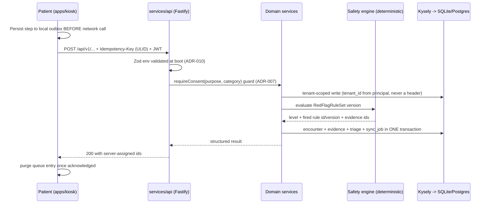

# MediKiosk System Architecture

**Snapshot:** 2026-09-15 · **Status vocabulary:** `IMPLEMENTED` | `PARTIALLY IMPLEMENTED` | `MOCKED` | `PLANNED` | `BLOCKED` — definitions and the measured repository state are in [`../LIMITATIONS.md`](../LIMITATIONS.md) §2–§3. Read that first.

Purpose of this document: state what the system is made of, where each part sits in the layer model,
which concrete files implement it, and how each part fails. **At the snapshot, every layer below the
specification is `PLANNED` except three packages whose sources exist but whose typechecks fail.**

---

## 1. Purpose

MediKiosk is a modular monolith, not a microservice system. `docs/BASELINE.md` §7 fixes that decision
and the reason for it: service boundaries exist in the module structure so that a module can be
extracted later only if a concrete reason appears (independent scaling, model-runtime isolation,
hardware isolation), not because a diagram looked better with boxes.

The system exists to do one thing: take a clinical history from a patient at a kiosk, without a
clinician present, and hand a physician a structured, evidence-linked, safely triaged case. Its
central invariant — from `docs/BASELINE.md` §7 — is:

> **the LLM is an assistant; the LLM is not the source of truth.**

Two structural consequences follow, and they are the reason this document is short on novelty and long
on boundaries:

1. Clinical facts are persisted in a canonical internal model with provenance (`ADR-005`), never as
   model output and never as a FHIR resource.
2. Every safety decision is made by deterministic rules (`ADR-009`), never by a model.

## 2. Position in the layer model

`docs/BASELINE.md` §7 defines six layers. This document describes the whole stack; each sibling
document in `docs/architecture/` states which layer it details.

| Layer (`BASELINE.md` §7) | Responsibility | Where implemented (intended path) | Status |
|---|---|---|---|
| PRESENTATION | Patient kiosk PWA; clinical console (doctor, triage, admin) | `apps/kiosk`, `apps/console`, `packages/ui` | `PLANNED` |
| API | Fastify, versioned, OpenAPI, HTTPS/JSON, idempotency keys, JWT | `services/api/src/index.ts`, `services/api/src/modules/*` | `PLANNED` |
| DOMAIN | Patient, Encounter, Symptom, Drug, Allergy, Diagnosis, Lab, Vital, Document, Consent, Questionnaire/QuestionnaireResponse | `services/api/src/modules/*`, `packages/clinical-schema` | `PARTIALLY IMPLEMENTED` (schema only) |
| INTELLIGENCE | ASR, OCR, NER, interview, summarisation, contradiction, evidence-linking — each behind a provider interface | `services/api/src/modules/*`, provider factories per `ADR-003` | `PLANNED` |
| SAFETY | Deterministic rules, validation, range checks, confidence gates, human review | `packages/safety-rules` | `PLANNED` |
| INTEROPERABILITY | FHIR R4, ABDM adapter, HIS/EMR outbox, sync | `packages/fhir-models`, `services/api/src/modules/{fhir,abdm,his,sync}` | `PLANNED` |
| INFRASTRUCTURE | DB, jobs, storage, secrets, logging, metrics, health | `services/api/src/{db,config,jobs,observability}/*` | `PLANNED` |

Module names under `services/api/src/modules/` are the intended decomposition derived from the DOMAIN
list in `BASELINE.md` §7. **No ADR fixes those directory names**; see `LIMITATIONS.md` Appendix A.

## 3. Component diagram (PLANNED)

Everything in this diagram is `PLANNED` except `packages/clinical-schema`, `packages/shared-types` and
`packages/i18n` (source present, build gates failing).

---

## 4. Concrete artefacts

Named exactly as they exist or as they are intended, with the layout fixed by ADR-001 (`packages/*`,
`services/*`, `apps/*`, `data/`, `evaluation/`, `tests/`, `docs/`, `infra/`, `scripts/`). Shared code
is imported by package name (`@medikiosk/clinical-schema`), never by relative path across a workspace
boundary — ADR-001 makes that the mechanism that keeps the boundaries real.

| Artefact | Role | Status |
|---|---|---|
| `package.json` (root) | npm-workspaces definition; scripts `dev:api`, `dev:kiosk`, `dev:console`, `db:migrate`, `db:seed`, `seed:demo`, `evaluate`, `demo:up`, `test`, `typecheck`, `format` | `IMPLEMENTED` (wiring only) |
| `tsconfig.base.json` | `strict`, `noUncheckedIndexedAccess`, ES2022, CommonJS, declaration maps; referenced by ADR-001's `tsc -b` requirement | `IMPLEMENTED` |
| `packages/shared-types` | Identifiers (`TenantId`, `PatientId`, `EncounterId`, …), provenance enums, response states, triage primitives, `Clock` | `PARTIALLY IMPLEMENTED` — 3 typecheck errors |
| `packages/clinical-schema` | SOCRATES, question/pathway model, declarative trigger language + evaluator, answer normalisation, concept ontology | `PARTIALLY IMPLEMENTED` — 4 typecheck errors |
| `packages/evidence-model` | Immutable `Evidence` and derived `ClinicalClaim` (ADR-005) | `PLANNED` |
| `packages/safety-rules` | Versioned `RedFlagRuleSet` and the deterministic engine (ADR-009) | `PLANNED` |
| `packages/fhir-models` | Internal model → FHIR R4 mapper and self-implemented validator (ADR-006) | `PLANNED` |
| `packages/i18n` | Catalogues, `createTranslator`, catalogue verification, clinical terms | `PARTIALLY IMPLEMENTED` — `src/locales/*` absent |
| `packages/auth` | Password hashing (`bcryptjs`), JWT (`jose`), RBAC roles and permission checks | `PLANNED` |
| `packages/ui` | Design tokens, primitives, clinical-status and evidence components | `PLANNED` |
| `services/api/src/index.ts` | Fastify bootstrap; entry point of `npm run dev:api` (`tsx watch src/index.ts`) | `PLANNED` |
| `services/api/src/config/*` | The single Zod environment schema that ADR-010 requires, and the startup refusal on fatal misconfiguration | `PLANNED` |
| `services/api/src/db/migrate-cli.ts`, `seed-cli.ts` | Migration and seed entry points named by the `db:migrate` / `db:seed` scripts in `services/api/package.json` | `PLANNED` |
| `services/api/src/db/*` | Kysely instance, `MEDIKIOSK_DB_DIALECT` selector, dialect-neutral column-type helpers (ADR-002) | `PLANNED` |
| `services/api/src/modules/*` | Domain, intelligence, safety and interoperability modules (see §2) | `PLANNED` |
| `services/api/src/jobs/*` | Database-backed job worker draining `sync_job` (ADR-004) — a job table rather than Postgres `LISTEN/NOTIFY`, which SQLite cannot provide | `PLANNED` |
| `apps/kiosk` | Patient PWA (React + Vite per `apps/kiosk/package.json`); local outbox, connectivity state | `PLANNED` |
| `apps/console` | Physician review, triage queue, kiosk fleet and administration consoles | `PLANNED` |
| `.env.example` | Every environment variable the runtime reads, including provider selection and secrets | `IMPLEMENTED` |
| `data/` | Migrations, pathway data, rule sets, seed profiles, synthetic evaluation datasets | `PLANNED` |
| `evaluation/run.ts` | Entry point of `npm run evaluate` (root script: `node --import tsx evaluation/run.ts`) | `PLANNED` |
| `scripts/demo-up.mjs` | Single-command demo entry point; deliberately does not require Docker (ADR-010) | `PLANNED` |
| `infra/docker/Dockerfile.api`, `Dockerfile.web`, `docker-compose.yml` | Deployment artefact of record (ADR-010) | `PLANNED` — Docker is not installed here |

**Naming caution.** `services/api/src/modules/<name>`, `data/`, `evaluation/` and `infra/docker/`
paths are the intended layout implied by the ADRs and the committed manifests. No ADR fixes those
directory names; see `../LIMITATIONS.md` Appendix A. Only these paths are named verbatim by a source
of truth: `services/api` (ADR-001), `packages/*` (ADR-001), `infra/docker/Dockerfile.api`,
`infra/docker/Dockerfile.web`, `infra/docker/docker-compose.yml` and `scripts/demo-up.mjs` (ADR-010),
`evaluation/interview` (ADR-008), `db/migrate-cli.ts` and `db/seed-cli.ts` (via
`services/api/package.json`).

## 5. Request path (PLANNED)

The intended request path, with the idempotency and tenancy rules that ADR-004 and ADR-011 make
mandatory. Every step below is `PLANNED`; the step that exists in code today is the Zod schema used at
step 3.

<!-- MEDIKIOSK-APPEND -->