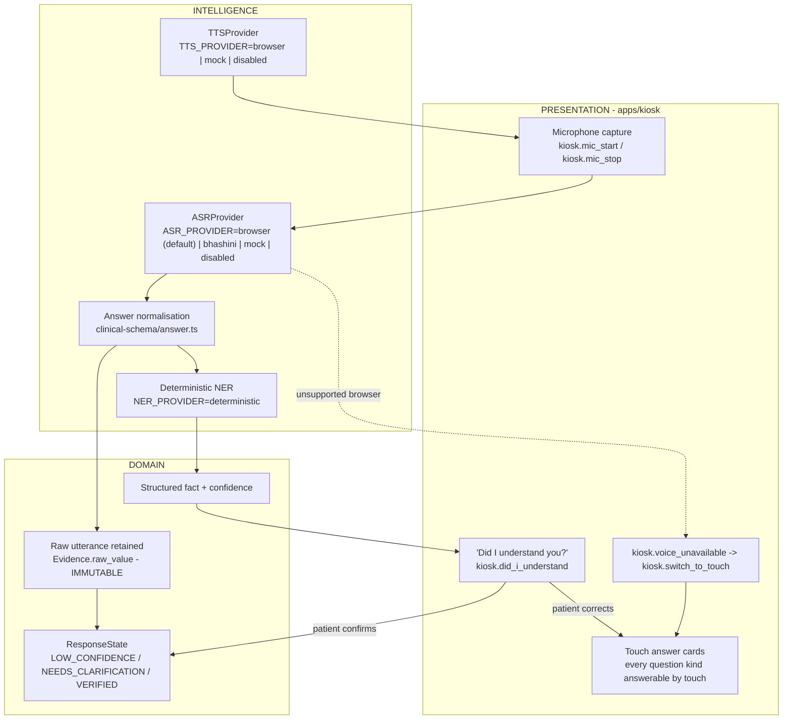

# Voice Pipeline

**Snapshot:** 2026-09-15 · **Status vocabulary and measured repository state:** [`../LIMITATIONS.md`](../LIMITATIONS.md) §2–§3.

Purpose: state how patient speech becomes structured clinical facts, what happens when it is
misrecognised, and why touch is not a fallback but a first-class modality. **No speech component
exists at the snapshot.**

---

## 1. Purpose

A patient standing at a kiosk in an Indian OPD must be able to answer clinical questions by speaking,
including in a language they read poorly, and including code-mixing ("mere chest mein kal se pain
hai"). Speech is therefore not a convenience feature; for a patient who cannot read, it is the only
path to being understood.

Equally, a misrecognised symptom is a clinical error. `R-03` in `BASELINE.md` §6 records this as a
high-likelihood, high-impact risk. The pipeline is therefore designed so that **a wrong transcription
cannot silently become a clinical fact**.

## 2. Position in the layer model

`docs/BASELINE.md` §7 places ASR and TTS in the **INTELLIGENCE** layer, behind provider interfaces,
with **SAFETY** above them and the **PRESENTATION** layer owning the microphone and the touch
alternative.

Every node is `PLANNED`. The single implemented artefact in this pipeline today is the data model:
`packages/clinical-schema/src/answer.ts` (`PARTIALLY IMPLEMENTED`, package typecheck fails).

---

## 3. Modality rules

| Rule | Rationale | Status |
|---|---|---|
| Every question kind must be answerable by touch as well as by voice | Voice-only questions would exclude patients who cannot or will not speak to a machine, and a kiosk in an Indian OPD must serve them. `QUESTION_KINDS` in `packages/clinical-schema/src/pathway.ts` defines `YES_NO`, `SINGLE_CHOICE`, `MULTI_CHOICE`, `FREE_TEXT`, `SEVERITY`, `BODY_SITE`, `DURATION`, `NUMBER`, `DATE`, `DOCUMENT_UPLOAD`, `INSTRUCTION`. | `PARTIALLY IMPLEMENTED` (the vocabulary is enforced in the data model) |
| A spoken answer is captured with its raw utterance alongside the normalised value | `Evidence.raw_value` is immutable; normalisation is additive (ADR-005). A physician must be able to see what the patient actually said. | `PARTIALLY IMPLEMENTED` |
| The capture modality is recorded | `RESPONSE_MODALITIES` = `VOICE`, `TOUCH`, `STAFF_ASSISTED`, `IMPORTED` with labels ("Spoken by patient", "Selected on screen", "Entered with staff assistance", "Imported from record") | `PARTIALLY IMPLEMENTED` |
| Uncertainty is a first-class outcome, never a guess | States `LOW_CONFIDENCE` ("Understood with low confidence"), `NEEDS_CLARIFICATION` ("Clarification needed"), `DECLINED` ("Patient declined to answer"), `UNKNOWN` ("Patient does not know") | `PARTIALLY IMPLEMENTED` |
| Question repetition is bounded | `pathwayQuestionSchema.maxAsks` (1–4, default 2) guards against clarification loops; a patient is never trapped repeating an answer | `PARTIALLY IMPLEMENTED` |
| Repeated clarification is bounded per SOCRATES dimension | `socratesSlotSchema.askCount` | `PARTIALLY IMPLEMENTED` |
| Voice intent is always reversible | `VERIFIED` ("Verified with patient") is a distinct state from `ANSWERED`, so a confirmed utterance is distinguishable from an accepted one | `PARTIALLY IMPLEMENTED` |

## 4. Failure modes and fallbacks

| Failure | Designed behaviour | Status |
|---|---|---|
| Browser has no speech support | Touch remains available via `kiosk.voice_unavailable` → `kiosk.switch_to_touch`. Voice is never the only path. | `PLANNED` |
| ASR returns low confidence (`R-03`) | State becomes `LOW_CONFIDENCE`, the patient is asked to confirm (`kiosk.did_i_understand`, `kiosk.tap_to_correct`), and the raw utterance is preserved beside the normalised value | `PLANNED` |
| ASR recognises a different symptom than the patient said | Not detectable by the system. Mitigation is confirmation plus preserved raw evidence; this residual risk is disclosed in `../LIMITATIONS.md` §6.2. | Known limitation |
| Patient code-mixes languages mid-sentence | Expected rather than exceptional: `normalisedAnswerSchema.language` and `.codeMixed` record it; concept synonyms include transliterated and English-mixed forms (see `concept.ts`) | `PARTIALLY IMPLEMENTED` |
| Patient switches language mid-interview | Intended to keep clinical state intact: all state is stored in the canonical model, not in the UI language (ADR-008) | `PLANNED` |
| Audio recorded but session wiped before processing | Transient audio is deleted by the wipe and the retention sweep (`MEDIKIOSK_TEMP_RETENTION_MINUTES`); an unsynchronised utterance is lost. Risk accepted and recorded: the wipe protects the next patient, which outweighs an unsent utterance. | Design constraint — see `../privacy/PRIVACY.md` §5 |
| Microphone unavailable or denied | Touch fallback only; the interview continues | `PLANNED` |

## 5. Status line

| Capability | Status |
|---|---|
| `ASRProvider` / `TTSProvider` interfaces and factories | `PLANNED` |
| Browser ASR (Web Speech API) | `PLANNED` — `ASR_PROVIDER=browser` is a documented default, not an artefact |
| Bhashini ASR | `PLANNED` / `BLOCKED — credentials` (no API key present) |
| Deterministic mock ASR for tests | `PLANNED` |
| Touch-only interview path | `PLANNED` (the data model requires touch answerability) |
| Raw-utterance preservation, code-mixing capture, bounded clarification | `PARTIALLY IMPLEMENTED` — present in `packages/clinical-schema` and `packages/shared-types`; both packages fail typecheck |
| Any ASR accuracy or clinical-fidelity measurement | **Not measured** — no number exists, and no `MEDIKIOSK BENCHMARK RESULT` may be quoted until the harness runs |

<!-- MEDIKIOSK-APPEND -->