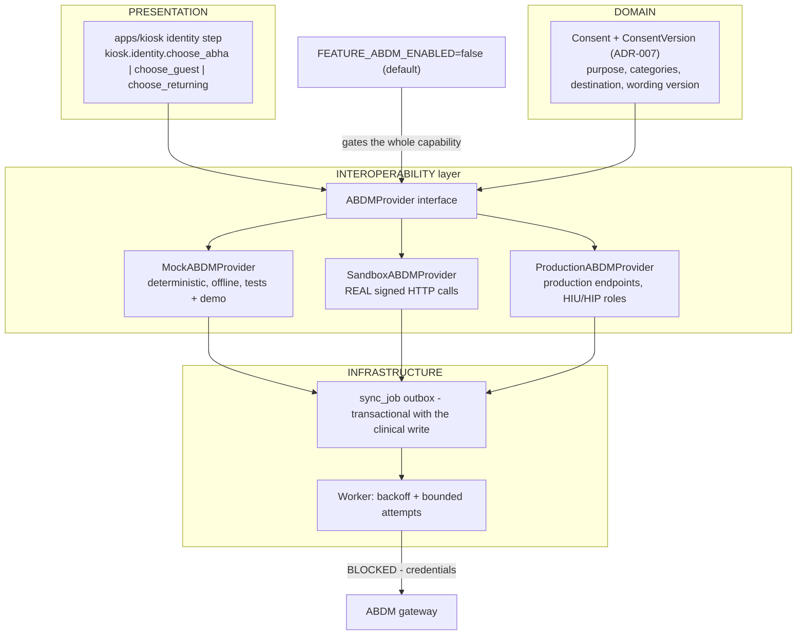
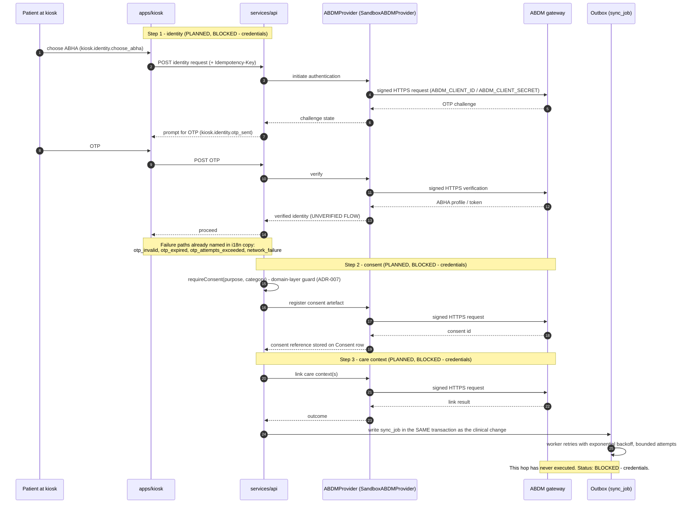

# ABDM / ABHA Interoperability

**Snapshot:** 2026-09-15 · **Status vocabulary and measured repository state:** [`../LIMITATIONS.md`](../LIMITATIONS.md) §2–§3.

> ## Status: `BLOCKED — credentials`
>
> **No ABDM exchange has ever been executed.** Not in production, not in the sandbox, not in a test,
> not in a demonstration. There is no ABHA number issued by this system, no consent artefact registered
> with ABDM, and no care context linked. The phrase "integrated with ABDM" must not be used about
> MediKiosk in any document, demonstration, README or submission.
>
> The honest description is: *the adapter boundary is designed; a deterministic mock provider and a real
> signed-HTTP sandbox client are specified; real exchange is blocked because no ABDM client credentials
> and no registered health facility exist.*

---

## 1. Purpose

MediKiosk should interoperate with India's Ayushman Bharat Digital Mission: identify a patient by ABHA,
link care contexts, and record consent artefacts under the ABDM consent architecture. Two facts
constrain this (ADR-006): **no ABDM sandbox credentials exist**, because onboarding requires a
registered health facility and approved client credentials; and fabricating an "ABDM integration" is
both impossible and dishonest.

## 2. Position in the layer model

`docs/BASELINE.md` §7 places the ABDM adapter in the **INTEROPERABILITY** layer, downstream of the
**DOMAIN** layer, with delivery made durable by the **INFRASTRUCTURE** layer's outbox (ADR-004).



Every node is `PLANNED` as code, and the path to `EXT` is `BLOCKED — credentials`.

## 3. The provider interface and its three implementations

```
ABDMProvider
  ├── MockABDMProvider        deterministic, offline, used by tests and demo
  ├── SandboxABDMProvider     real HTTP calls, requires approved credentials; BLOCKED until issued
  └── ProductionABDMProvider  same interface as sandbox, production endpoints, HIU/HIP roles
```

ADR-006 is explicit that `SandboxABDMProvider` is **real code that performs real signed HTTP requests
against the configured base URL — it is not a stub**. It simply cannot be *executed* here because no
credentials exist. That distinction matters: the *implementation status* of the sandbox client is
"written and contract-tested against the mock", while the *execution status* is `BLOCKED — credentials`.

**At the snapshot, none of the three exists as an artefact** — `services/api` and `packages/fhir-models`
contain no source — so all three are `PLANNED`, and the credential block is the reason they cannot be
exercised once written.

**Why two fakes is not acceptable.** A single mock provider with no real client would make the ABDM
claim untestable in principle. A real client with no mock would make the entire test suite depend on
network access and credentials. Both are needed, which is why the interface exists and the mock is
deterministic.

## 4. Configuration surface (from `.env.example`)

| Variable | Purpose | Present today |
|---|---|---|
| `IDENTITY_PROVIDER` | `mock` (deterministic local identity, "DEMO ONLY, never claims to be ABHA") or `abha` (real ABDM ABHA adapter) | Value documented; default `mock` |
| `ABDM_CLIENT_ID` | Client credentials — **empty** | Documented, unset |
| `ABDM_CLIENT_SECRET` | Client secret — **empty** | Documented, unset |
| `ABDM_BASE_URL` | Defaults to `https://sandbox.abdm.gov.in` | Documented |
| `ABDM_ENVIRONMENT` | `sandbox` | Documented |
| `FEATURE_ABDM_ENABLED` | Per-tenant feature flag; **defaults to `false`** | Documented; ADR-011 requires server-side enforcement, not a UI toggle |

The comment in `.env.example` for `IDENTITY_PROVIDER=mock` states the constraint that the mock identity
must "never claim to be ABHA". That is a design requirement, not a nicety: a kiosk showing an ABHA
number that no ABDM service issued would be a false statement to a patient.

---

## 5. What is implemented versus what is blocked

This split is the whole point of the document, so it is stated as a table rather than as prose.

| Element | Code status | Execution status |
|---|---|---|
| `ABDMProvider` interface (method surface for identify, link care context, consent) | `PLANNED` | n/a |
| `MockABDMProvider` (deterministic, offline, used by tests and demo) | `PLANNED` | Would run offline once written |
| `SandboxABDMProvider` (real signed HTTP requests, configured base URL) | `PLANNED` | **`BLOCKED — credentials`** |
| `ProductionABDMProvider` (production endpoints, HIU/HIP roles) | `PLANNED` | **`BLOCKED — credentials`** |
| ABHA number entry / OTP flow in the kiosk | `PLANNED` | **`BLOCKED — credentials`**; only `IDENTITY_PROVIDER=mock` is usable |
| Care-context linking | `PLANNED` | **`BLOCKED — credentials`** |
| Consent artefact registration with ABDM | `PLANNED` | **`BLOCKED — credentials`**. Note the internal consent model (`Consent`, `ConsentVersion`) is a separate, working design (`ADR-007`); registering it *with ABDM* is what is blocked. |
| HIU / HIP role configuration | `PLANNED` | **`BLOCKED — credentials` and `BLOCKED — registered health facility`** |
| `sync_job` outbox for ABDM transmissions | `PLANNED` | Would run locally once written |
| `FEATURE_ABDM_ENABLED` gating the whole capability | `PLANNED` (value `false` in `.env.example`) | Flag is documented; no enforcement code exists |

## 6. Mermaid sequence: ABHA authentication and care-context flows

**This diagram is `PLANNED` and `UNVALIDATED`.** Nothing in it has been executed, and the ABDM API
surface it implies has not been verified against published ABDM specifications by this project. It is
included because an activation checklist without a flow is not actionable.



Design constraints visible in the diagram, each of which already exists in the ADR set:

- **Consent precedes processing.** The `requireConsent(purpose, category)` guard runs in the domain
  service layer, not in the route handler and not in the UI (ADR-007). A UI-only check would be
  bypassable and is therefore not a control at all.
- **Delivery is transactional.** The `sync_job` row is written with the clinical change, so a failed
  ABDM call cannot lose clinical data (ADR-004).
- **Failure copy is already authored.** The intended identity failure states correspond to translation
  keys that exist in the catalogue key list (`kiosk.identity.otp_invalid`, `otp_expired`,
  `otp_attempts_exceeded`, `network_failure`) — although the catalogue values themselves are absent
  (`../LIMITATIONS.md` §7.3).
- **`UNVALIDATED`** marks that no ABDM specification review, sandbox call or conformance test has been
  performed against this flow.

---

## 7. Activation checklist for an operator

Every item is a **precondition** for any real ABDM exchange. Until all are satisfied, the correct status
of ABDM in any MediKiosk deployment remains `BLOCKED — credentials`.

| # | Precondition | Who | Evidence required | Status |
|---|---|---|---|---|
| 1 | A health facility registered with ABDM | Hospital | Registration acknowledgement / facility id | **Not satisfied** |
| 2 | HIP and/or HIU role assigned for that facility | Hospital + ABDM | Role assignment record | **Not satisfied** |
| 3 | Client credentials issued (`ABDM_CLIENT_ID`, `ABDM_CLIENT_SECRET`) | ABDM | Credential issuance | **Not satisfied** |
| 4 | Sandbox base URL confirmed (`ABDM_BASE_URL`) with `ABDM_ENVIRONMENT=sandbox` | Operator | Configuration diff | Default documented only |
| 5 | Request-signing key material generated, stored outside the repository, and a rotation procedure written down | Operator | Secret-store record + rotation runbook | **Not satisfied**; no rotation procedure is defined by any ADR |
| 6 | `IDENTITY_PROVIDER=abha` set and the boot-time configuration check passing with credentials present | Operator | Startup log with no fatal configuration error | **Not satisfied** — the check is `PLANNED` |
| 7 | `FEATURE_ABDM_ENABLED` enabled for that specific tenant | Tenant admin | Audited feature-flag change in the admin console | `PLANNED` (documented default is `false`) |
| 8 | Patient-facing consent wording reviewed by the hospital's legal/ethics function, with a `ConsentVersion` recorded | Hospital | Signed review + version id | **Not satisfied** |
| 9 | `SandboxABDMProvider` exercised end-to-end in sandbox with call logs retained | Engineer | Sandbox exchange log | **Never performed** |
| 10 | `ProductionABDMProvider` exercised against production endpoints in a controlled window | Engineer + hospital | Production exchange log | **Never performed** |
| 11 | Error handling reviewed: OTP expiry, attempt limits, network failure, revocation mid-flow | Engineer + clinical reviewer | Review record | **Not satisfied** |
| 12 | Data flow documented for the hospital's DPDPA review, including exactly what ABDM receives | Hospital | Privacy review | **`NOT ESTABLISHED`** — no legal review has occurred ([`../privacy/PRIVACY.md`](../privacy/PRIVACY.md) §7) |

Two items are commonly skipped and deserve emphasis:

- **Item 5**: no ABDM signing-key rotation procedure exists anywhere in this project. Without one, a
  leaked key has no defined remedy.
- **Item 12**: an ABDM exchange transmits PHI into national infrastructure. The hospital — not the
  software — is the party that must determine whether its legal basis covers that transfer. MediKiosk
  cannot and does not make that determination.

## 8. Failure modes and fallbacks

| Failure | Designed behaviour | Status |
|---|---|---|
| `IDENTITY_PROVIDER=abha` with no credentials configured | The runtime **refuses to start** on fatal misconfiguration — ADR-010 names this exact case. Failing loudly at boot beats silently running without identity. | `PLANNED` |
| Gateway unreachable | The transmission is already committed as a `sync_job` row in the clinical write transaction and the worker retries with backoff. However, a failed *identity* step means no encounter can be attributed to an ABHA; the intended fallback is the guest path (`kiosk.identity.choose_guest` with copy `kiosk.identity.guest_notice`). | `PLANNED` |
| OTP invalid / expired / attempts exceeded | Distinct copy exists for each case — `kiosk.identity.otp_invalid`, `otp_expired`, `otp_attempts_exceeded` — so a patient is told what happened instead of seeing a generic error | Keys defined in the intended catalogue key set; catalogue values absent today |
| Patient has no ABHA | By design ABHA is never mandatory: `kiosk.identity.choose_guest` exists. A kiosk that could only serve ABHA holders would exclude much of the population it is built for. | `PLANNED` |
| Consent revoked after care-context linking | Revocation re-checks the same domain guard on every read and write, so further processing stops immediately (ADR-007). What happens to already-transmitted data is an ABDM-policy question, not a software one. | `PLANNED` / open |
| `MockABDMProvider` used in a demonstration | It must be visibly labelled: the mock identity path has the copy `kiosk.identity.mock_notice`, and ADR-003 rule 4 requires the active provider to be visible in health and the admin console. A mock must never be presented as ABHA. | `PLANNED` |

## 9. Status line

| Capability | Status |
|---|---|
| ABDM architecture, provider interface, three intended implementations | `PLANNED` |
| Any ABDM HTTP request issued by this system | **Never** |
| Any ABHA number issued, resolved or verified by this system | **Never** |
| Any consent artefact registered with ABDM | **Never** |
| Any care context linked | **Never** |
| ABDM onboarding, conformance or certification | **`NOT ESTABLISHED`** — no onboarding, no certification, no review |
| A national ABDM exchange capability may be claimed | **No.** Status is `BLOCKED — credentials` until checklist §7 items 1–12 are satisfied **and evidenced**. |

<!-- MEDIKIOSK-APPEND -->