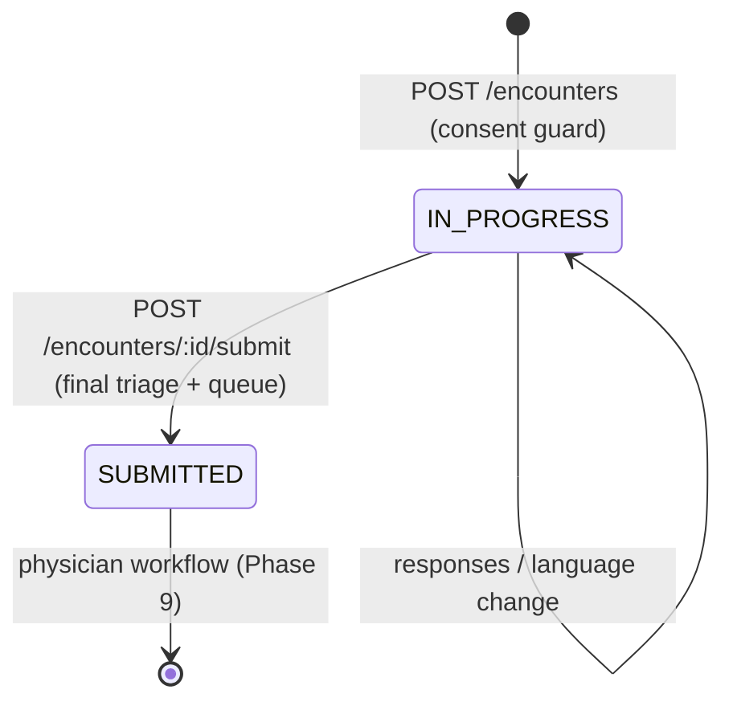
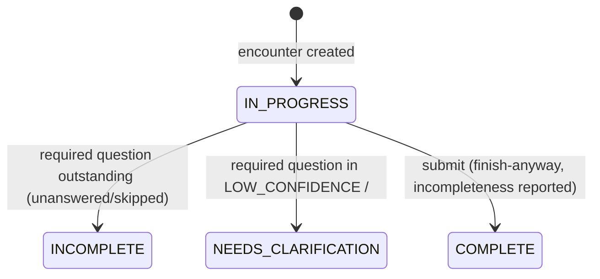
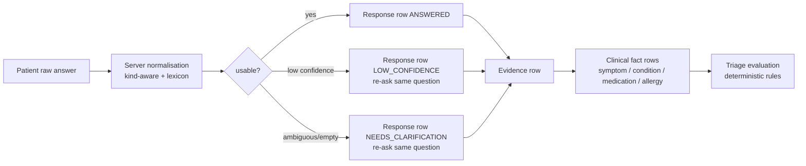

# Interview domain — deterministic clinical interview runtime

Status: IMPLEMENTED (Phase 3). Companion decision record: `docs/adr/ADR-012-interview-runtime.md`.
Engine source: `packages/interview-engine`; API runtime: `services/api/src/interview`.

## 1. What this is

A persistent, versioned, deterministic clinical interview. The runtime decides what to ask next,
interprets what the patient answered, generates evidence for every clinical fact, evaluates
completion, and feeds the deterministic triage engine — with **no UI, voice, ASR, LLM or OCR**
required. All of it is replayed from `questionnaire_responses` + clinical fact rows +
`evidence`.

## 2. State machine

### Encounter lifecycle (persisted on `encounters.status`)

Invalid transitions fail deterministically: creating an encounter twice with one idempotency key
replays; with a different key it is a new encounter. Submitting an already-submitted encounter is
`409 ENCOUNTER_ALREADY_SUBMITTED`.

### Interview status (derived, never stored)

`interview_sessions.status` keeps lifecycle bookkeeping only (`ACTIVE | COMPLETED | ABANDONED`).
The clinical interview status is recomputed on every request from the response history:

`SAFETY_ESCALATION` is not a stored state: the API reports it when the latest triage assessment
is non-GREEN or `requiresHumanReview`, and routing happens at submission.

## 3. Response lifecycle

- Raw text is immutable per row. A correction or retry is a **new row** with `askCount` + 1.
- `DECLINED` / `UNKNOWN` / `NOT_APPLICABLE` are terminal and generate an evidence row
  (a refusal is a fact); `SKIPPED` is open and re-askable while `askCount < maxAsks`.
- The client's `normalisedAnswer` is an untrusted hint; the server recomputes and records
  `hintMismatch` when the interpretation differs.

## 4. Question selection (deterministic)

Priority: category rank (SAFETY_CRITICAL first) → pathway `priorityRank` → pathway order.
Candidates: unanswered questions plus questions in an open state within `maxAsks`.
Branches gate their questions (`answeredYes` conditions). Age bounds apply. A per-pathway
`maxQuestions` budget stops a pathway once exhausted. The selection exposes a `rationale`.

## 5. Completion rules

A question is closed when terminal (`ANSWERED | VERIFIED | DECLINED | UNKNOWN |
NOT_APPLICABLE`). The interview is COMPLETE when every applicable required question is closed and
the SOCRATES required ratio is met (per-complaint profiles; `SOCRATES_PROFILES` registry).
Otherwise INCOMPLETE, or NEEDS_CLARIFICATION when a required question sits in an open
low-confidence/clarification state. `canFinishAnyway` is always true — submission is never
blocked by incompleteness, and the outstanding list is reported instead.

## 6. Triage integration

After every fact-changing response and at submission, the runtime builds a
`RuleEvaluationInput` (symptom codes + duration/severity facts, non-negated answered-YES
question keys, unresolved safety-critical question keys, conditions, medications, allergies,
age/sex) and runs `evaluateTriage` from `@medikiosk/safety-rules`. The assessment row stores
level, priority, rule-set version, hits (with evidence references) and a clinician-readable
explanation. **No rule fires without its `evidenceRequired` facts** (evidence-gated), and
unresolved safety-critical questions surface as the `DATA_INCOMPLETE_SAFETY_001` advisory
(`requiresHumanReview`) rather than a fabricated acuity.

## 7. Error model (all via `MediKioskError`)

| Code | HTTP | Meaning |
|---|---|---|
| `SESSION_EXPIRED` | 401 | kiosk session past TTL |
| `CONSENT_MISSING` / `CONSENT_REVOKED` / `CONSENT_EXPIRED` / `CONSENT_PURPOSE_NOT_PERMITTED` | 403 | consent guard failed |
| `ENCOUNTER_NOT_FOUND` (NOT_FOUND) | 404 | wrong tenant / wrong session / absent |
| `ENCOUNTER_ALREADY_SUBMITTED` | 409 | second submit with a different key |
| `ENCOUNTER_NOT_EDITABLE` | 409 | mutation on a submitted encounter |
| `INTERVIEW_SESSION_NOT_ACTIVE` | 409 | interview lifecycle not ACTIVE |
| `QUESTION_NOT_ACTIVE` | 400 | answered a question the engine is not asking |
| `QUESTION_ALREADY_COMPLETED` | 409 | re-answered a terminal question with no open state |
| `CLARIFICATION_REQUIRED` | 422 | endpoint demands clarification resolution |
| `VALIDATION_FAILED` | 400 | malformed body / unsupported state |

Errors never leak stacks, SQL, paths or PHI (single handler in `platform/http-errors.ts`).

## 8. Audit actions (interview-related)

`ENCOUNTER_CREATED`, `INTERVIEW_STARTED`, `FACT_EXTRACTED`, `QUESTION_SKIPPED`,
`QUESTION_DECLINED`, `CLARIFICATION_REQUESTED`, `SAFETY_CONDITION_TRIGGERED`,
`TRIAGE_EVALUATED`, `INTERVIEW_LANGUAGE_CHANGED`, `ENCOUNTER_SUBMITTED`, `TRIAGE_TRIGGERED`,
`RECORD_VIEWED`. Payloads are codes/keys/counts only — never raw clinical text.

## 9. Failure modes

| Failure | Behaviour |
|---|---|
| Session expires mid-interview | mutations rejected `SESSION_EXPIRED`; persisted rows retained per retention policy; no new data accepted |
| Consent revoked mid-interview | response & submit rejected `CONSENT_REVOKED`; already-persisted record retained (deleting it would be the failure) |
| Client disconnects | each response is one durable transaction; no partial state |
| Same request twice | idempotency replay returns the stored response; different payload ⇒ 409 |
| Unknown question key | `QUESTION_NOT_ACTIVE` (or `QUESTION_ALREADY_COMPLETED`) |
| Pathway version mismatch | encounter recorded `pathwayVersion`; current registry version must match, else `INTERVIEW_SESSION_NOT_ACTIVE` (historical versions are data additions, recorded in LIMITATIONS) |
| Triage rule set invalid | `TRIAGE_RULE_SET_INVALID` (500) |

## 10. Future AI integration points

ASR/voice, OCR/document extraction, and LLM summarisation will attach to the same spine:
document-derived facts get `DOCUMENT_DERIVED` evidence rows; AI-drafted summaries must cite
`evidence` rows and keep `AI_INFERRED` provenance; no Phase 4+ capability may write
patient-reported-looking evidence. The engine's normalization entry point
(`evaluateResponse`) is the seam for provider-based ASR text; question selection and completion
stay deterministic.